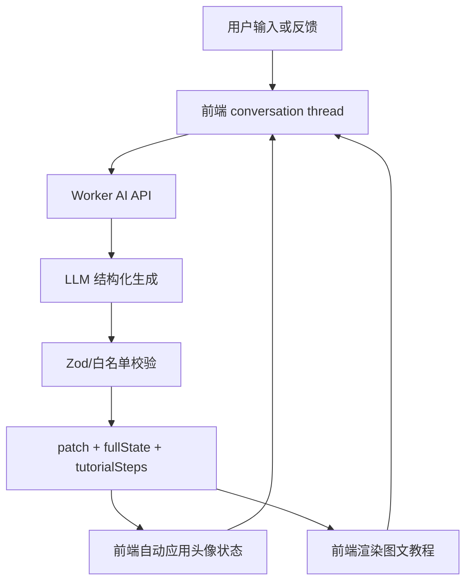
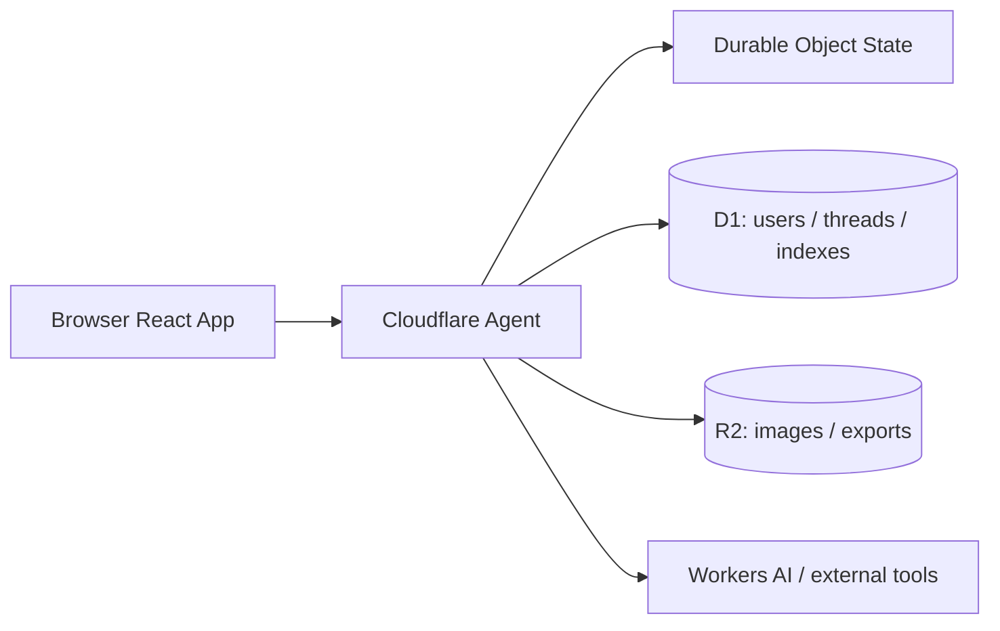

# Agent 工程化路线图

## 1. 背景与目标

当前项目已经具备静态头像编辑器、GitHub Pages / Cloudflare Pages 双前端部署、Cloudflare Worker AI API 骨架，以及基础的文本生成头像配置能力。但现有 AI 功能仍处于一次性调用阶段，不是完整 agent 工程。

本路线图的目标是把项目拆成多个可独立交付、可测试、可回滚的步骤，逐步演进为“多轮对话生成可编辑头像 + 图文复刻教程 + 未来服务端记忆与用户系统”的产品。

核心原则：

- 每个步骤单独设计、单独实现、单独测试、单独部署。
- 不把 React、Worker TS、多轮对话、图文教程、ZIP 导出和服务端 Agent 一次性塞进同一个版本。
- 当前阶段优先保证公网编辑器稳定可用。
- 所有后端密钥只放 Worker secrets 或未来服务端环境，不进入前端和仓库。

## 2. 当前问题盘点

| 问题 | 当前表现 | 影响 |
| --- | --- | --- |
| `verify` 与 `generate` 竞态 | Verify 后必须很快点 Generate，否则 session 可能被 Turnstile callback 清掉 | AI 功能难以稳定使用 |
| 中文输入输出英文 | 用户中文 prompt 可能得到英文说明和英文教程 | 用户体验割裂 |
| 教程只有文字 | 步骤只显示 `option 1` 之类文本，没有目标图、位置和最终效果 | 用户很难在编辑器里复刻 |
| 当前不是多轮 agent | 每次请求只基于当前 prompt，缺少对话 thread、历史反馈和上轮结果 | 用户无法持续修正“眼镜不对”“发型再短一点”等问题 |
| Worker 仍是 JS | 复杂 schema、LLM 输出校验、SSE 协议和后续 Agent 迁移缺少类型支撑 | 长期维护风险增加 |
| catalog 语义不足 | 很多 Rive 选项只有 state/value/index，没有稳定语义标签 | 模型容易保守选择或乱选 |
| 前端仍是单 HTML | 状态、教程、对话、导出、测试 hook 都堆在一个文件里 | 继续扩展会变慢且容易破坏已有功能 |

## 3. 核心概念拆分

后续实现必须明确区分以下概念，避免再次把安全验证、对话记忆和头像状态混在一起。

| 概念 | 作用 | v1 位置 | 未来位置 |
| --- | --- | --- | --- |
| 防滥用凭证 | 证明浏览器有权调用 AI，降低刷接口风险 | Turnstile + 短时 AI access token | Cloudflare Challenge / Pre-clearance + 服务端限流 |
| 对话记忆 | 保存多轮用户输入、agent 回复、反馈、状态变化 | `sessionStorage` conversation thread | Cloudflare Agents SDK / Durable Object |
| 头像状态 | 当前可编辑头像的完整 state，以及每轮改动 patch | 前端 local/session state | Agent state + D1 快照索引 |
| 教程渲染 | 展示每步目标选项图、位置、最终头像图 | 前端基于 Rive 和 catalog 渲染 | 前端仍渲染，服务端只返回结构化步骤 |
| 语义 catalog | 把 Rive state/value 变成模型可理解的选项目录 | 规则增强 + 少量人工标签 | 可维护的语义数据层，必要时入库 |

整体数据流目标：

## 4. 敏捷实施步骤

### 01. Vite + React + TypeScript 前端基建迁移

目标：

- 引入 Vite、React、TypeScript。
- 保持当前编辑器 UI、移动端布局和核心功能基本一致。
- 保持 GitHub Pages / Cloudflare Pages 的 `_site` 发布目录兼容。
- 不改变 AI 行为，不重写 Worker，不做多轮对话。

独立文档：

- `docs/agent-steps/01-vite-react-foundation.md`

### 02. Worker TypeScript + Zod 运行时校验

目标：

- 将 `worker/index.js` 迁移为 TypeScript。
- 引入 Zod 校验 API 入参、模型输出、SSE final payload。
- 保持现有 `/health`、`/api/config`、`/api/avatar/session`、`/api/avatar/generate` endpoint 兼容。
- 暂不接入 Cloudflare Agents SDK。

验收重点：

- Worker 单测覆盖合法输入、非法输入、模型脏输出、session 失效、Origin 不匹配。
- Wrangler 部署流程保持不变。

独立文档：

- `docs/agent-steps/02-worker-typescript-zod.md`

### 03. 修复安全验证链路

目标：

- 明确区分 AI access token 和 conversation thread。
- v1 使用“AI 动作验证”策略：编辑器可直接访问，首次 AI 调用前完成 Turnstile。
- Generate 首次点击时自动获取短时 access token，再继续生成，避免单独 Verify 按钮带来的竞态。
- roadmap 保留后续“全站预验证”路线：自定义域名接入 Cloudflare zone 后，再考虑 Challenge Page / Pre-clearance。

验收重点：

- 用户不需要在 Verify 和 Generate 之间抢时间。
- 多轮对话期间可复用有效 access token。
- access token 过期时提示用户重新验证，不清空对话 thread。

独立文档：

- `docs/agent-steps/03-security-verification-flow.md`

### 03.1 语义生成链路修复

目标：

- 不 hardcode 固定人物名单，用离线 semantic catalog 描述 Rive 选项的通用视觉特征。
- 运行时模型只输出目标特征，由 Worker 匹配合法 `state/value` 并组装 `avatarState`。
- 阻止默认值、不可见依赖项和低置信度选项进入成功结果。
- `final` 返回 `selectionTrace`，便于排查每个选项的匹配来源。

验收重点：

- `斯大林 @default`、`卓别林 @default` 不再生成默认头像或不可见改动。
- semantic catalog 缺失或版本不匹配时阻止生成，而不是回到旧的裸 option 猜测。
- 离线视觉标注只在人工显式运行脚本时发生，不接入部署、CI 或用户 Generate。

独立文档：

- `docs/agent-steps/03.1-semantic-generation-flow.md`

### 04. SSE Agent 协议、语言策略与结构化 schema

目标：

- 继续使用 HTTP + SSE，不引入 WebSocket。
- 支持边聊边生成，但最终成功标准只看结构化 `final` 事件。
- AI 区域语言跟随用户输入语言，中文 prompt 输出中文说明和教程。
- 每轮返回 `patch + fullState + tutorialSteps`，而不是只有散文说明。

建议事件：

| event | 用途 |
| --- | --- |
| `assistant_delta` | 流式展示 agent 正在分析或解释 |
| `status` | 当前阶段，如读取上下文、生成结构化方案、校验结果 |
| `final` | 已校验的 patch、fullState、教程步骤、warnings、confidence |
| `error` | 可恢复错误或失败原因 |

### 05. 本地多轮 conversation thread

目标：

- 使用 `sessionStorage` 保存当前标签页的多轮对话。
- 关闭标签页后清空，刷新页面不丢。
- 每轮请求带上最近对话、当前头像 state、上轮 patch 和用户反馈摘要。
- New chat 只清空对话，不重置当前头像。

建议数据：

| 字段 | 说明 |
| --- | --- |
| `threadId` | 浏览器生成的当前对话 id |
| `messages` | 用户输入、agent 回复摘要、错误信息 |
| `currentAvatarState` | 当前完整头像 state |
| `turns` | 每轮 patch、fullState、教程步骤、warnings |
| `language` | 最近用户语言 |

### 06. 规则增强 semantic catalog

目标：

- 先用规则增强，不做 200+ 选项全人工标注。
- 给模型提供更可用的 option 描述，减少“option 1”乱选。
- 优先覆盖常见输入：中文人物名、鲁迅、眼镜、发型、胡子、衣服颜色、背景、年龄感、表情反馈。

输出要求：

- state/value 必须来自当前 Rive catalog。
- 每个选项附带 tab、section、index、颜色、kind、可选语义标签。

### 07. 图文教程、目标选项位置与跳转高亮

目标：

- 每个教程步骤显示目标选项图。
- 显示选项位置：`分类 > 分区 > 第 N 个选项`。
- 提供按钮切到对应分类、滚动到目标选项、短暂高亮。
- 最后展示最终头像渲染图。
- 生成完成后停留在聊天页，不自动切回编辑器。

教程图片来源：

- 颜色步骤：显示 swatch。
- 部件步骤：复用 Rive tile 缩略图渲染能力。
- 最终图：从主头像 canvas 导出。

### 08. ZIP 导出

目标：

- 导出完整对话包。
- 使用本地 JSZip 依赖，由 Vite 打包，不使用 CDN。

ZIP 内容：

| 文件 | 内容 |
| --- | --- |
| `conversation.md` | 人类可读的对话、每轮结果、复刻步骤 |
| `thread.json` | 可恢复或调试的完整 thread 数据 |
| `final-avatar.png` | 当前最终头像 |
| `steps/step-*.png` | 每步目标选项图 |

### 09. 远期 Cloudflare Agents SDK、D1、R2、用户系统

目标：

- 迁移为 TypeScript Cloudflare Edge Agent。
- 使用 Agents SDK / Durable Object 管活跃会话。
- 使用 D1 存用户、会话索引、权限、账单等结构化数据。
- 使用 R2 存导出包、用户上传图片、大文件。
- 用户系统后续再选型。
- Playwright 替换现有 Python CDP E2E 放入远期规划，不在近期强行迁移。

远期服务端结构：

## 5. 存储路线取舍

| 路线 | 优点 | 缺点 | 从本地 v1 迁移难度 |
| --- | --- | --- | --- |
| Agents + D1 + R2 | Cloudflare 原生；活跃会话、结构化数据和大文件职责清楚；适合未来多端和用户系统 | 绑定多，数据一致性和迁移要设计 | 中等，只要 v1 thread schema 稳定 |
| 只用 D1 | SQL 简单，查询和备份清楚，实现门槛较低 | 实时 agent 会话弱，每轮都要重建上下文 | 中等偏高，未来要拆热状态到 Durable Object |
| 外部数据库 | Postgres/Supabase 生态强，Python/分析/向量检索友好 | 多供应商、网络、密钥、连接池复杂度更高 | 最高，除非未来决定 Python 主后端 |

默认路线：

- 近期：本地 `sessionStorage` conversation thread。
- 中期：Cloudflare Agents SDK + Durable Object 活跃状态。
- 远期：D1 管结构化索引，R2 管图片和导出包。

## 6. 安全与验证路线

### v1 阶段

- 编辑器页面直接访问。
- 只有 AI 对话调用需要 Turnstile。
- Turnstile token 只用于服务端换短时 AI access token。
- AI access token 不等于 conversation thread。
- access token 过期不清空用户对话。

### 后续阶段

- 若绑定自定义域名到 Cloudflare zone，可评估全站 Challenge Page 或 Turnstile Pre-clearance。
- 对匿名用户增加速率限制、prompt 长度限制、每 thread 轮数限制。
- 对登录用户再引入配额、历史记录和云端保存。

## 7. 语言与真实人物策略

语言策略：

- AI 对话区跟随用户输入语言。
- 中文 prompt 输出中文说明、warnings 和教程。
- 编辑器基础分类可以暂时保留英文，后续再单独做本地化。

真实人物策略：

- 支持生成“风格化近似”的 Duolingo 风格头像。
- 不承诺精确肖像还原。
- 教程应说明哪些选择来自可用编辑器选项，哪些属于近似。

## 8. 文档管理规则

- `docs/agent-roadmap.md` 只维护总路线、阶段边界和长期架构。
- 每个步骤单独放在 `docs/agent-steps/`。
- 实现任何步骤前，先确认对应步骤文档。
- 每次只实现一个步骤，避免范围蔓延。
