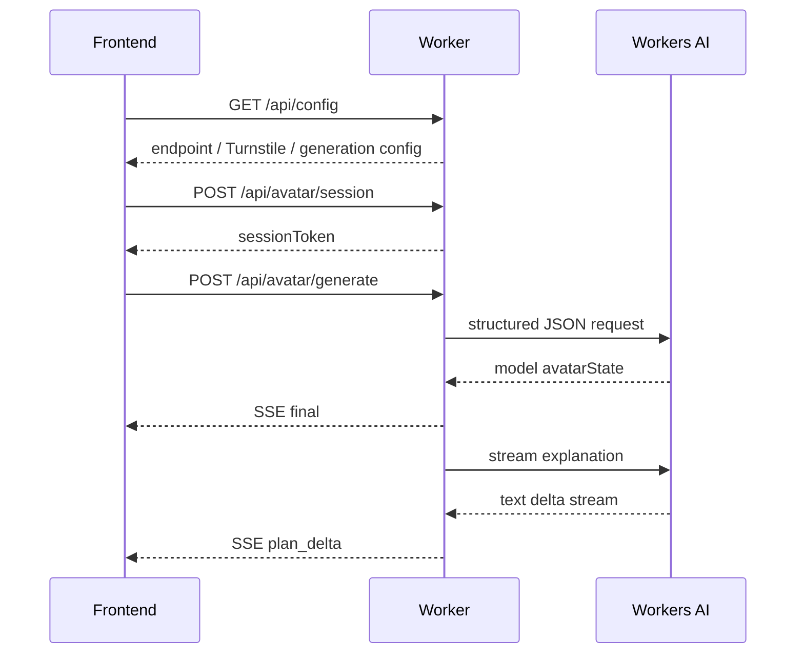
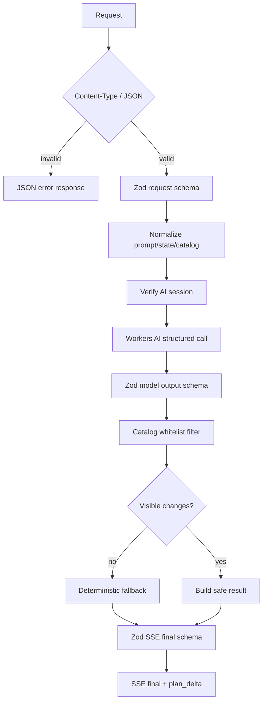

# 02. Worker TypeScript + Zod 运行时校验

## 1. 目标

本步骤只做 Worker 工程化和运行时校验增强，不改变现有 AI 产品行为。

目标：

- 将 Worker 入口从 `worker/index.js` 迁移为 `worker/index.ts`。
- 引入 Zod，对 API 入参、模型结构化输出和 SSE `final` payload 做运行时校验。
- 为 Worker 单独建立严格 TypeScript 检查，不提高前端 `tsconfig.json` 的严格度。
- 保持现有 `/health`、`/api/config`、`/api/avatar/session`、`/api/avatar/generate` endpoint 兼容。
- 保持现有 SSE 事件和前端消费方式兼容。
- 继续使用当前 Workers AI 调用和确定性 fallback 策略。

不做：

- 不修复 `verify` 与 `generate` 竞态。
- 不改前端 Turnstile / AI 交互。
- 不引入多轮 conversation thread。
- 不重构 SSE agent 协议。
- 不新增 `patch`、`fullState`、`tutorialSteps` 字段。
- 不接入 Cloudflare Agents SDK、Durable Object、D1、R2。
- 不引入 Vitest；更完整的 Worker runtime/integration 测试后续单独评估。

## 2. 当前状态

第 1 步后，前端已经迁移到 Vite + React + TypeScript，但 Worker 仍是 JavaScript：

| 项目 | 迁移前状态 | 本步骤目标 |
| --- | --- | --- |
| Worker 入口 | `worker/index.js` | `worker/index.ts` |
| Worker 类型检查 | 无独立 TS 检查 | `tsconfig.worker.json` + strict |
| Env 类型 | 手写或隐式依赖运行时 | `wrangler types` 生成 `worker-configuration.d.ts` |
| API 校验 | 手写宽容归一化 | Zod schema + 保留错误码 |
| 模型输出校验 | 手写过滤 state/value | Zod 结构校验 + catalog 白名单 |
| 测试执行 | `node --test` 直接加载 JS | `tsx --test` 加载 TS |

现有前端依赖的行为必须保留：



## 3. 接口兼容

本步骤不改变公开接口。

Worker API：

| 路径 | 方法 | 兼容要求 |
| --- | --- | --- |
| `/health` | `GET` | 返回 `{ ok, service, version }` |
| `/api/config` | `GET` | 返回现有 feature、generation、endpoint 字段 |
| `/api/avatar/session` | `POST` | 使用 `turnstileToken` 换取短时 `sessionToken` |
| `/api/avatar/generate` | `POST` | 校验 session 后，以 SSE 返回生成结果 |
| `OPTIONS *` | `OPTIONS` | CORS preflight 保持 204 |

`/api/avatar/generate` 请求体保持：

| 字段 | 类型 | 处理 |
| --- | --- | --- |
| `prompt` | string | 空值返回 `prompt_required`，超长返回 `prompt_too_long` |
| `contextMode` | `default` / `current` | 非法值归一为 `default` |
| `baselineState` | object | 只保留 number / boolean state 值 |
| `catalog` | object | Zod 校验结构，再归一化 option |
| `sessionToken` | string | 缺失返回 `session_required` |

SSE 事件保持：

| event | data |
| --- | --- |
| `status` | 当前阶段文案 |
| `final` | `{ ok, contextMode, model, avatarState, steps, summary, confidence, warnings, usedFallback }` |
| `plan_delta` | 已应用编辑的流式说明 |
| `error` | 生成失败原因 |

`final.avatarState` 继续是前端可直接应用的扁平对象：

```ts
Record<string, number | boolean>
```

## 4. 校验策略

本步骤的原则是“入口更严格，输出更安全，错误码不变”。

### 4.1 API 入参

| 请求 | Zod 校验 | 兼容处理 |
| --- | --- | --- |
| session body | `turnstileToken` 为非空字符串 | 缺失或空字符串仍返回 `turnstile_token_required` |
| generate body | 先校验为 object，再逐字段归一 | 非 object JSON 不抛异常，按缺字段处理 |
| prompt | 归一空白并截取上限 + 1 | 保留 `prompt_required` / `prompt_too_long` |
| baselineState | 只接受 number / boolean | 非法字段直接丢弃 |
| catalog | `states -> stateName -> options[]` | 非法 option 跳过，空 catalog 返回 `catalog_required` |

### 4.2 catalog 白名单

Worker 不信任模型输出，也不信任前端传入的散乱 option。catalog 会被压缩为：

```text
catalog.states[stateName] -> [
  { value, tab, section, kind, color?, index? }
]
```

处理规则：

- `value` 只允许 `number | boolean`。
- `tab`、`section`、`kind`、`color` 会转为短字符串。
- `index` 只保留有限数字。
- 同一个 state 下重复 value 会去重。
- 全局最多保留 `MAX_CATALOG_OPTIONS` 个 option。
- 模型输出的 `state/value` 必须命中该白名单，否则进入 `warnings` 并跳过。

### 4.3 模型输出

模型输出先经过 Zod 结构校验，再进入白名单过滤。

支持两种兼容形态：

```ts
avatarState: Array<{ state, value | valueNumber | valueBoolean }>
```

或旧的对象形态：

```ts
avatarState: Record<string, number | boolean>
```

输出归一化结果：

| 字段 | 规则 |
| --- | --- |
| `avatarState` | 只保留 catalog 支持的 state/value |
| `steps` | 最多保留 12 条非空字符串 |
| `summary` | 最多保留 280 字符 |
| `confidence` | clamp 到 `0..1` |
| `warnings` | 最多保留 10 条 |

### 4.4 SSE final payload

发送 `final` 前再做一次 Zod 校验：

```ts
{
  ok: true,
  contextMode: 'default' | 'current',
  model: string,
  avatarState: Record<string, number | boolean>,
  steps: string[],
  summary: string,
  confidence: number,
  warnings: string[],
  usedFallback: boolean
}
```

如果最终 payload 不符合 schema，Worker 不发送脏 `final`，而是进入现有 `error` SSE 分支。

## 5. 实现方案

目标文件：

```text
worker/index.ts
tsconfig.worker.json
worker-configuration.d.ts
tests/worker.test.mjs
wrangler.toml
package.json
```

关键实现：

- `wrangler.toml` 的 `main` 指向 `worker/index.ts`。
- `worker-configuration.d.ts` 由 `npx wrangler types worker-configuration.d.ts --include-runtime false` 生成，并随仓库提交。
- Worker 运行时类型由 `@cloudflare/workers-types` 提供，避免提交大体积 runtime declaration。
- `tsconfig.worker.json` 只包含 Worker 和生成类型，启用 `strict: true`。
- `zod` 放在 `dependencies`，因为 Worker 运行时需要。
- `tsx` 和 `@cloudflare/workers-types` 放在 `devDependencies`。
- `test:worker` 使用 `tsx --test tests/worker.test.mjs`，继续保留 Node 内置 `node:test`。

运行时流程：



## 6. 测试计划

本步骤完成后至少运行：

```bash
npm run test:worker
npx tsc -p tsconfig.worker.json --noEmit
npm run build:site
npm run test:static
git diff --check
```

建议有浏览器环境时继续运行：

```bash
npm run test:e2e
```

Worker 单测覆盖：

| 场景 | 预期 |
| --- | --- |
| `/health` | 返回服务名、版本和 CORS |
| `/api/config` | 返回现有公开配置 |
| session 缺少 token | `400 turnstile_token_required` |
| Turnstile 失败 | `403 turnstile_failed` |
| Turnstile 配置缺失 | `503 turnstile_not_configured` |
| generate 缺少 session | `401 session_required` |
| session 无效 | `403 session_invalid` |
| session Origin 不匹配 | `403 session_origin_mismatch` |
| 非法 JSON | `400 invalid_json` |
| 错误 Content-Type | `400 invalid_content_type` |
| 空 prompt | `400 prompt_required` |
| 非法 catalog | `400 catalog_required` |
| 模型脏输出 | 跳过非法 state/value，保留合法编辑 |
| 结构化 AI 抛错 | 返回 fallback 头像改动 |
| SSE final | 字段齐全且通过 Zod schema |

## 7. 验收标准

本步骤算完成，必须满足：

- Worker 入口已迁移为 TypeScript。
- Worker strict 类型检查通过。
- API endpoint、错误码、SSE event 与当前前端兼容。
- 模型脏输出不会直接进入 `final.avatarState`。
- fallback 行为不回退。
- Worker 单测覆盖新增 Zod 校验场景并通过。
- 文档、代码、测试同一次提交并推送。

## 8. 后续不在本步骤处理

这些事项仍保留在后续 roadmap：

- 第 3 步：修复 Verify / Generate 竞态，自动获取短时 access token。
- 第 4 步：SSE Agent 协议、语言策略与结构化 `patch + fullState + tutorialSteps`。
- 第 5 步：本地多轮 conversation thread。
- 第 6 步：semantic catalog 增强。
- 第 7 步：图文教程、目标选项位置与跳转高亮。
- 第 8 步：ZIP 导出。
