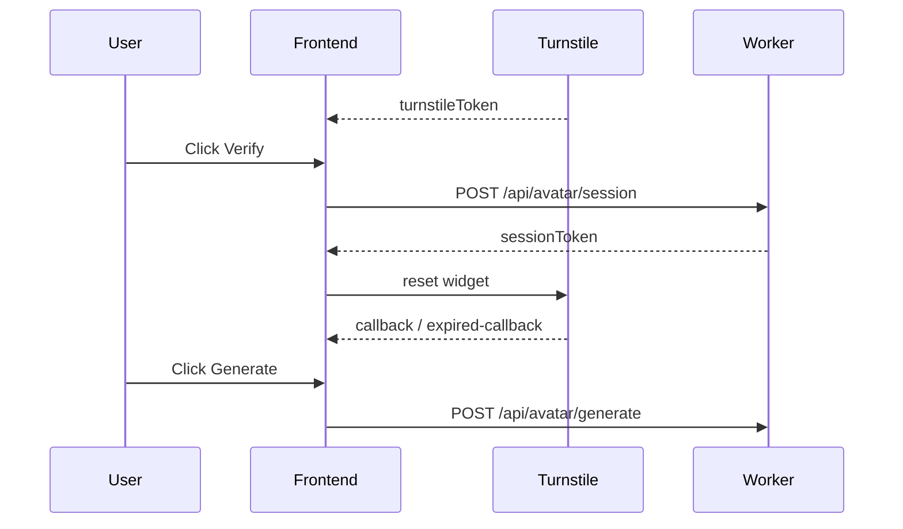
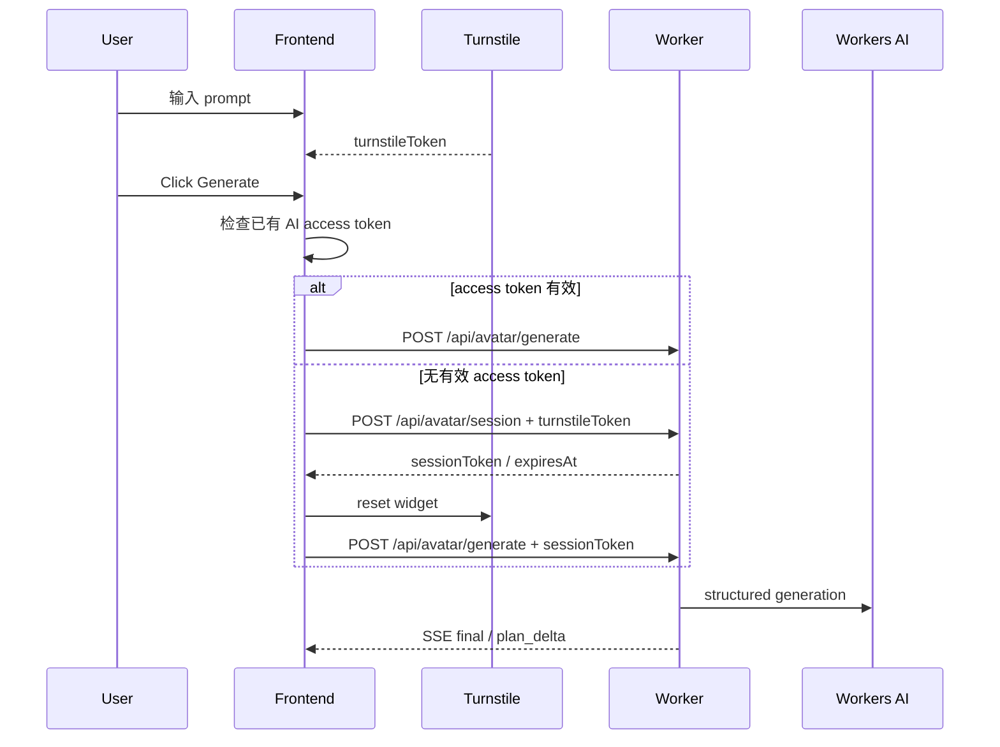

# 03. 修复安全验证链路

## 1. 目标

本步骤只修复 AI 调用前的安全验证链路，解决 `Verify` 与 `Generate` 两步操作之间的竞态问题。

目标：

- 明确区分 AI access token 与后续 conversation thread。
- 使用“AI 动作验证”策略：编辑器页面可直接访问，首次 AI 生成前完成 Turnstile。
- 用户点击 `Generate editable avatar` 后，前端自动获取短时 AI access token，再继续生成。
- 有效期内复用已有 AI access token，避免每轮生成都重新验证。
- access token 过期或失效时，只清除 access token 并提示重新验证，不清空 prompt、头像状态或生成结果。
- 保持现有 Worker API、SSE event 和 `sessionStorage` key 兼容。

不做：

- 不新增 Worker endpoint。
- 不改变 `/api/avatar/session` 和 `/api/avatar/generate` 的请求或响应结构。
- 不实现多轮 conversation thread。
- 不引入 Cloudflare Agents SDK、Durable Object、D1、R2。
- 不实现全站 Challenge Page 或 Turnstile Pre-clearance。
- 不重构 SSE agent 协议。
- 不新增 `patch`、`fullState`、`tutorialSteps` 字段。

## 2. 当前问题

当前前端把验证和生成拆成两个显式动作：



这个流程的问题：

| 问题 | 表现 | 影响 |
| --- | --- | --- |
| 操作窗口过窄 | Verify 后需要很快点击 Generate | 用户容易遇到 session 被清掉 |
| Turnstile 与 session 耦合 | widget reset / callback 可能清除本地 session | 生成按钮状态不稳定 |
| UI 心智复杂 | 用户需要理解 Verify 才能生成 | AI 入口门槛高 |
| 与 thread 概念混淆 | session token 看起来像对话状态 | 后续多轮对话容易设计混乱 |

## 3. 目标流程

第三步采用“点击生成时自动验证”的流程：



关键原则：

- Turnstile token 只用于换取短时 AI access token。
- AI access token 只证明浏览器当前可调用 AI，不代表 conversation thread。
- conversation thread 仍留给第 05 步实现。
- 生成页不再展示可见 `Verify` 按钮。

## 4. 状态规则

前端状态职责：

| 状态 | 来源 | 存储 | 用途 |
| --- | --- | --- | --- |
| `turnstileToken` | Turnstile callback | 内存 | 换取短时 AI access token |
| `aiSession.sessionToken` | `/api/avatar/session` | `sessionStorage` + 内存 | 调用 `/api/avatar/generate` |
| `aiSession.expiresAt` | `/api/avatar/session` | `sessionStorage` + 内存 | 判断 access token 是否仍可复用 |
| prompt | 用户输入 | DOM | 本轮生成请求 |
| avatar state | Rive state | local/session state | 本轮 baseline |

按钮启用规则：

| 条件 | Generate 状态 | 状态文案 |
| --- | --- | --- |
| 后端或 Turnstile 未配置 | disabled | AI generation is unavailable until the backend and Turnstile are configured. |
| 正在生成 | disabled | Generating editable avatar... |
| prompt 为空 | disabled | Describe the avatar to generate. |
| 有有效 AI access token | enabled | Ready to generate. |
| 无 access token，但有 Turnstile token | enabled | Ready to generate. Verification will run automatically. |
| 无 access token，也无 Turnstile token | disabled | Complete the Turnstile check, then generate. |

`verifyAiSession()` 保留为兼容函数，但只作为 `ensureAiSessionToken()` 的包装，不再由主要 UI 按钮触发。

## 5. 错误处理

错误处理必须保护用户输入和当前头像状态：

| 场景 | 前端处理 |
| --- | --- |
| Turnstile token 缺失 | 不请求 Worker，提示先完成验证 |
| `/api/avatar/session` 失败 | 清除本地 AI access token，保留 prompt 和页面状态 |
| `/api/avatar/generate` 返回 `session_*` 错误 | 清除本地 AI access token，重置 Turnstile，提示重新点击 Generate |
| SSE `error` | 保留 prompt、头像状态和已有结果，显示错误 |
| access token 本地过期 | 清除本地 AI access token，不清空对话或头像状态 |

本步骤选择“提示后重试”策略：session 过期或失效后不自动重发生成请求，避免在用户不知情时重复调用 AI。

## 6. 实现方案

目标文件：

```text
docs/agent-steps/03-security-verification-flow.md
docs/agent-roadmap.md
src/legacy/legacyMarkup.ts
src/legacy/avatarExplorer.ts
tests/test_avatar_explorer.py
```

前端实现：

- 从生成页 UI 移除可见 `Verify` 按钮。
- 保留 `verifyAiBtn` 查询和 `verifyAiSession()` 全局函数兼容，旧按钮节点允许不存在或被启动时移除。
- 新增 `requestAiSessionToken()`：只负责调用 `/api/avatar/session` 并保存返回的 access token。
- 新增 `ensureAiSessionToken()`：先复用有效 session；没有 session 时用当前 Turnstile token 自动换取；返回可用于生成的 token。
- 修改 `updateAiControls()`：Generate 只依赖 prompt、配置状态，以及“有效 session 或 Turnstile token”。
- 修改 `startAvatarGeneration()`：先调用 `ensureAiSessionToken()`，再请求 `/api/avatar/generate`。
- 修改 session 错误文案：过期或失效时提示用户完成验证后再次点击 Generate。

Worker 实现：

- 不修改公开接口。
- 不修改 session token 格式。
- 不修改 CORS、Origin 校验和 Turnstile 校验逻辑。

## 7. 测试计划

本步骤完成后至少运行：

```bash
npm run test:worker
npx tsc -p tsconfig.worker.json --noEmit
npm run build:site
npm run test:static
python3 tests/test_avatar_explorer.py --port 8775 --debug-port 9228 --test 12
git diff --check
```

浏览器可用时继续运行：

```bash
npm run test:e2e
```

E2E 覆盖重点：

| 场景 | 预期 |
| --- | --- |
| Generate 页面 | 不显示可见 Verify 按钮 |
| prompt + Turnstile token | Generate 可点击 |
| 首次 Generate | 先调用 `/api/avatar/session`，再调用 `/api/avatar/generate` |
| 有效 session | 后续生成复用 session，不要求重新 Verify |
| session 错误 | 清除 access token，保留 prompt 和头像状态 |
| AI final | 头像状态应用，undo/redo 仍可恢复 |

## 8. 验收标准

本步骤算完成，必须满足：

- 用户不需要在 Verify 和 Generate 之间抢时间。
- 生成页没有可见 `Verify` 按钮。
- 点击 Generate 能自动换取短时 AI access token 并继续生成。
- 多轮生成期间能复用有效 AI access token。
- access token 过期或失效时不清空 prompt、头像状态或已有生成结果。
- Worker API 和 SSE event 与第 02 步保持兼容。
- 相关文档、代码、测试同一次提交并推送。

## 9. 后续不在本步骤处理

这些事项仍保留在后续 roadmap：

- 第 04 步：SSE Agent 协议、语言策略与结构化 `patch + fullState + tutorialSteps`。
- 第 05 步：本地多轮 conversation thread。
- 第 06 步：semantic catalog 增强。
- 第 07 步：图文教程、目标选项位置与跳转高亮。
- 第 08 步：ZIP 导出。
- 远期全站 Challenge Page / Pre-clearance。
