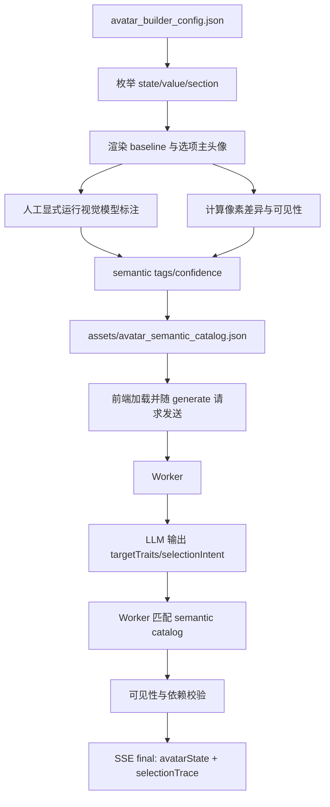

# 03.1 语义生成链路修复

## 1. 背景

当前 AI 生成链路让模型直接从精简 catalog 中选择 `state/value`。由于发型、胡子、帽子等选项缺少语义标签，模型容易把人物名请求错误映射成默认值或不可见改动，例如只改 `GlassesColor` 但 `Glasses=0`，最终表现为“生成成功但视觉完全没变化”。

本步骤在第 03 步安全验证链路之后、第 04 步 SSE Agent 协议之前实施，目标是先修复生成决策链路，而不是调整教程 UI 形态。

## 2. 目标

- 不 hardcode 固定人物名单。
- 使用离线 semantic catalog 描述 Rive 可选项的通用视觉特征。
- 运行时模型只输出目标特征，不直接输出 raw `state/value`。
- Worker 根据 semantic catalog 匹配合法选项并组装 `avatarState`。
- 阻止 no-op、不可见依赖项和低质量结果进入 `final`。
- 生成 `selectionTrace`，便于在 DevTools / Network 中排查匹配原因。

## 3. 整体流程



## 4. 离线标注

离线脚本只在人工显式运行时调用视觉 LLM，不接入部署、CI 或用户 Generate。

命令入口：

| 命令 | 作用 |
| --- | --- |
| `npm run semantic:catalog` | dry-run 生成或检查 catalog，不调用 Cloudflare API |
| `npm run semantic:catalog -- --sample FacialHair:1` | 生成单个选项的视觉标注输入预览，不调用 API |
| `npm run semantic:catalog -- --sample FacialHair:1 --run` | 只调用 1 次 Cloudflare REST 视觉模型，并输出样本报告 |
| `npm run semantic:catalog -- --run --limit 20 --resume` | 小批量补充标注，限制调用数量并复用缓存 |
| `npm run semantic:catalog -- --run --all --resume` | 明确确认后才允许全量补充标注 |
| `npm run semantic:catalog -- --resume` | 复用已有标注和截图缓存 |
| `npm run semantic:check` | 校验已提交 semantic catalog |

安全约束：

- `--run` 默认拒绝无边界全量执行，必须同时提供 `--sample`、`--limit`、`--option-id` 或 `--all`。
- 单样本报告写入 `.cache/avatar-semantic/samples/`，包含截图状态、视觉模型输入 prompt、原始响应和解析结果。
- 先用单样本确认输入、解析和标签质量，再按 `--limit` 小批量扩展。

输出：

| 文件 | 说明 |
| --- | --- |
| `assets/avatar_semantic_catalog.json` | 运行时使用的语义选项目录 |
| `docs/agent-steps/03.1-semantic-catalog-review.md` | 低置信度、冲突或需复核选项清单 |
| `.cache/avatar-semantic/` | 截图缓存，忽略入库 |

## 5. 运行时接口

前端随 `/api/avatar/generate` 发送的 catalog 必须包含：

```json
{
  "semanticVersion": 1,
  "sourceVersion": "avatar_builder_25_sept2025",
  "configSourceVersion": "avatar_builder_25_sept2025",
  "states": {},
  "semanticOptions": []
}
```

`semanticOptions[]` 关键字段：

| 字段 | 说明 |
| --- | --- |
| `optionId` | 稳定选项 id，例如 `FacialHair:3` |
| `state` / `value` | Rive state 与合法值 |
| `group` | 受控语义分组，例如 `facial_hair` |
| `tags` | 受控语义标签 |
| `confidence` | 标签置信度 |
| `visible` | 是否可见 |
| `needsReview` | 是否需要人工复核 |
| `statesToOverride` | 点击该选项时相关 state 覆盖 |

模型运行时输出目标特征：

```json
{
  "summary": "风格化近似生成说明",
  "confidence": 0.72,
  "selectionIntent": [
    { "group": "facial_hair", "tags": ["mustache"], "required": true },
    { "group": "headwear", "tags": ["bowler_like"], "required": false },
    { "group": "clothing_color", "tags": ["dark"], "required": true }
  ],
  "warnings": []
}
```

Worker 返回的 `final` 增加：

```json
{
  "selectionTrace": [
    {
      "trait": "facial_hair:mustache",
      "matchedOptionId": "FacialHair:1",
      "state": "FacialHair",
      "value": 1,
      "score": 0.86,
      "reason": "matched tags: mustache"
    }
  ]
}
```

前端不新增可见 Debug UI，仅保存最近一次结果：

```js
window.avatarGenerationDebug.lastFinal
```

## 6. 校验规则

- semantic catalog 缺失时，前端禁用 Generate，Worker 返回 `semantic_catalog_required`。
- semantic catalog 版本与当前 Rive/config 不匹配时，Worker 返回 `semantic_catalog_version_mismatch`。
- Worker 不接受模型直接输出的 raw `avatarState` 作为最终决策源。
- 仅颜色状态不可见时不得单独应用，例如 `GlassesColor` 不能在 `Glasses=0` 时成为唯一结果。
- `needsReview: true` 或 `visible: false` 的选项默认不参与自动匹配。
- 人物名请求至少应产生多个可见改动；无法稳定匹配时返回 warning，而不是假装精确还原。

## 7. 验收标准

- `斯大林 @default`、`卓别林 @default` 不再退化成默认值或仅不可见颜色变化。
- `final.avatarState` 至少包含可见的毛发、配饰、衣服或表情改动之一。
- `selectionTrace` 可说明每个选项来自哪个 trait。
- semantic catalog 缺失/版本不匹配时前后端都阻止生成。
- `npm run semantic:check`、`npm run test:static`、`npm run test:worker` 通过。
