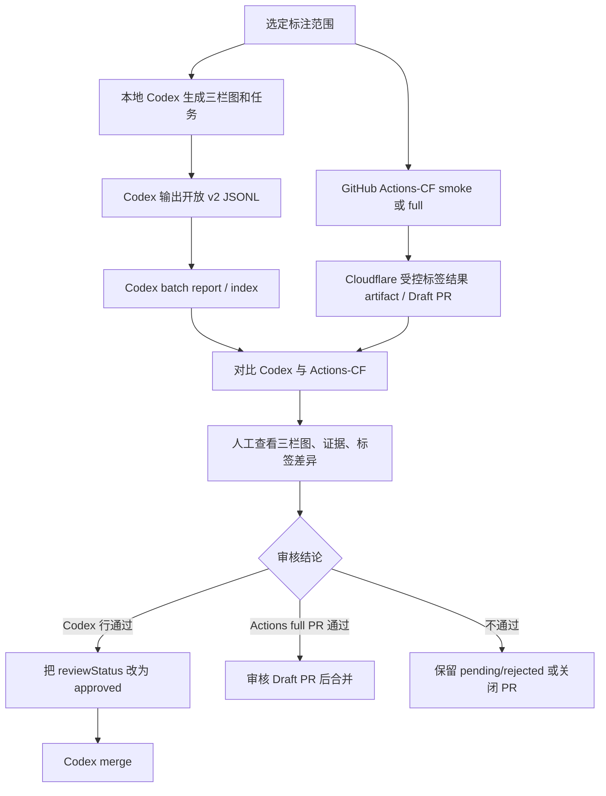

# 03.3 语义标注操作手册

本文是语义标注的实际操作手册，覆盖两条链路：

- 本地 Codex：在 Codespaces 中生成三栏图，由 Codex 输出开放 JSONL，人工审核后只合并 `approved`。
- Actions-CF：在 GitHub Actions 中调用 Cloudflare Workers AI，生成受控标签 catalog、artifact 或 Draft PR。

两条链路都不是自动真理来源。最终入库以人工审核为准，Codex 和 Cloudflare 结果都只是候选证据。

## 目录

- [1. 关键入口速查](#1-关键入口速查)
- [2. 总流程](#2-总流程)
- [3. 本地 Codex 标注](#3-本地-codex-标注)
- [4. Actions-CF 标注](#4-actions-cf-标注)
- [5. 结果对比](#5-结果对比)
- [6. 人工审核与合并](#6-人工审核与合并)
- [7. 成本与禁止事项](#7-成本与禁止事项)
- [8. 记录模板](#8-记录模板)
- [9. 常见输出位置](#9-常见输出位置)

## 1. 关键入口速查

| 目标 | 入口 | 是否调用 Cloudflare API | 主要输出 |
| --- | --- | --- | --- |
| Codex smoke 截图任务 | `npm run semantic:codex:tasks -- --smoke` | 否 | `.cache/avatar-semantic/codex/tasks/smoke-001.json` |
| Codex 全量分批任务 | `npm run semantic:codex:tasks -- --all-features --batch-size 10` | 否 | `.cache/avatar-semantic/codex/tasks/features-*.json` |
| Codex 审核报告 | `npm run semantic:codex:report` | 否 | `.cache/avatar-semantic/codex/reports/index.md` |
| Codex 合并前检查 | `npm run semantic:codex:merge -- --input .cache/avatar-semantic/codex/labels/features-001.jsonl --check-only` | 否 | `.cache/avatar-semantic/codex/merge-report.json` |
| Actions-CF smoke | GitHub Actions: `Semantic catalog smoke` | 是 | artifact `semantic-catalog-smoke-*` |
| Actions-CF full | GitHub Actions: `Semantic catalog full labeling` | 是 | artifact `semantic-catalog-full-*`，可能创建 Draft PR |
| Codex / CF 对比 | `npm run semantic:codex:compare -- --codex ... --cloudflare ...` | 否 | `.cache/avatar-semantic/codex/compare-report.md` |
| catalog 校验 | `npm run semantic:check` | 否 | 终端校验结果 |

## 2. 总流程



推荐顺序：

1. 先跑 Codex smoke。
2. 再跑 Actions-CF smoke。
3. 对比同一批结果。
4. smoke 两边都可信后，再进入 Codex 分批或 Actions-CF full。
5. 所有结果先审核，不直接入库。

## 3. 本地 Codex 标注

### 3.1 准备浏览器

Codespaces 中如果还没有 Chromium，先安装：

```bash
npx playwright install --with-deps chromium
```

这个命令只准备本地截图浏览器，不会调用 Cloudflare API。

### 3.2 Codex smoke

用途：验证截图、任务包、JSONL schema、报告和合并门禁。

```bash
npm run semantic:codex:tasks -- --smoke
```

预期输出：

| 路径 | 用途 |
| --- | --- |
| `.cache/avatar-semantic/codex/tasks/smoke-001.json` | 当前 smoke 任务 |
| `.cache/avatar-semantic/codex/images/*.compare.png` | 三栏图：baseline / option / diff |
| `.cache/avatar-semantic/codex/tasks/current-task-set.json` | 当前任务 manifest |

然后让 Codex 只读取当前任务和当前图片，输出：

```text
.cache/avatar-semantic/codex/labels/smoke-001.jsonl
```

Codex 输出要求：

- 每个 option 一行 JSON。
- `schemaVersion` 固定为 `2`。
- `tags` 使用开放视觉标签。
- `attributes` 必须是对象。
- `reviewStatus` 默认写 `pending`，不要让模型自行写 `approved`。
- `imagePath` 必须等于任务包中的 compare 图路径。

生成报告：

```bash
npm run semantic:codex:report
```

查看：

```text
.cache/avatar-semantic/codex/reports/index.md
.cache/avatar-semantic/codex/reports/smoke-001.md
```

合并前检查：

```bash
npm run semantic:codex:merge -- --input .cache/avatar-semantic/codex/labels/smoke-001.jsonl --check-only
```

如果所有行仍是 `pending`，这个命令失败是预期行为。它证明未审核结果不会误合并。

### 3.3 Codex 分批标注

用途：按小批量持续标注，避免一次上下文太长，也方便逐批复核。

示例：只标某一组。

```bash
npm run semantic:codex:tasks -- --all-features --group main_hair --batch-size 10
```

示例：自定义几个 option。

```bash
npm run semantic:codex:tasks -- --option-id MainHair:48,Expression:31,Glasses:1 --batch-size 3
```

每批只让 Codex 读取对应任务文件，例如：

```text
.cache/avatar-semantic/codex/tasks/features-001.json
```

并只写对应 labels 文件：

```text
.cache/avatar-semantic/codex/labels/features-001.jsonl
```

每完成一批：

```bash
npm run semantic:codex:report
npm run semantic:codex:merge -- --input .cache/avatar-semantic/codex/labels/features-001.jsonl --check-only
```

检查重点：

- batch report 中图片是否非空，baseline / option / diff 是否稳定。
- `captureMetrics` 中 `fallbackStates` 是否异常偏高。
- `tags` 是否准确描述 option，而不是描述 baseline。
- `attributes` 是否补充了长度、形状、覆盖区域、情绪、位置等维度。
- `needsReview=true` 是否合理。

### 3.4 Codex 全量标注

全量前必须先完成：

- Codex smoke 通过。
- Actions-CF smoke 通过。
- 至少一轮 Codex / CF 对比已看过。

生成全部 feature option 的任务：

```bash
npm run semantic:codex:tasks -- --all-features --batch-size 10
```

处理规则：

- 每次只让 Codex 看一个 batch。
- 不让 Codex 读取其他 batch report、总索引或历史长上下文。
- 每批单独写 `labels/features-xxx.jsonl`。
- 每批完成后运行 `npm run semantic:codex:report`。

审核后合并某批：

```bash
npm run semantic:codex:merge -- --input .cache/avatar-semantic/codex/labels/features-001.jsonl
npm run semantic:check
```

只有 `reviewStatus=approved` 的行能合并。`attributes` 只用于 JSONL 和报告，不进入 Worker 匹配。

## 4. Actions-CF 标注

Actions-CF 指 GitHub Actions 调用 Cloudflare Workers AI。它和 Codex 的区别：

| 项目 | 本地 Codex | Actions-CF |
| --- | --- | --- |
| 执行位置 | Codespaces / 本地工作区 | GitHub Actions |
| 标签策略 | 开放 `tags` + `attributes` + `reviewStatus` | 当前为受控 tags，写入 semantic catalog 形态 |
| 成本 | 不调用 Cloudflare API | 会调用 Cloudflare API |
| 输出 | `.cache/avatar-semantic/codex/**` | workflow artifact，full 可能开 Draft PR |
| 合并门禁 | 只合并 `approved` JSONL | full Draft PR 必须人工审核 |

### 4.1 Secrets

Actions-CF 需要仓库中已有以下 GitHub Secrets：

| Secret | 用途 |
| --- | --- |
| `CLOUDFLARE_ACCOUNT_ID` | Cloudflare account id |
| `CLOUDFLARE_API_TOKEN` | 调用 Workers AI REST API |

本文不写 Cloudflare token 创建教程。只要 workflow 能读到这两个 secret，就会把它们传给 `scripts/semantic_catalog.py --run`。

### 4.2 Actions-CF smoke

用途：小成本验证 Cloudflare API、截图、解析和 artifact。

GitHub Web UI：

1. 打开 GitHub 仓库。
2. 进入 `Actions`。
3. 选择 workflow：`Semantic catalog smoke`。
4. 点击 `Run workflow`。
5. 输入参数。
6. 等待 run 完成。
7. 查看 Summary 和 artifact。

常用输入：

| 输入 | 示例 | 说明 |
| --- | --- | --- |
| `option_ids` | `FacialHair:1` | 优先级最高，可用逗号或空格分隔 |
| `group` | `main_hair` | 当 `option_ids` 为空时按 group 选择 |
| `offset` | `0` | group-based run 的起始偏移 |
| `limit` | `3` | group-based run 的数量 |
| `max_calls` | `3` | 硬性 API 调用上限 |
| `model` | `@cf/meta/llama-4-scout-17b-16e-instruct` | Workers AI vision model |

推荐 smoke 组合：

| 场景 | 输入 |
| --- | --- |
| 单样本 | `option_ids=FacialHair:1`, `max_calls=1` |
| 跨组选样 | `option_ids=FacialHair:1 Headwear:10 Glasses:1 MainHair:48 Expression:31`, `max_calls=5` |
| 分组小批量 | `option_ids=` 空，`group=main_hair`, `offset=0`, `limit=3`, `max_calls=3` |

artifact 名称：

```text
semantic-catalog-smoke-<run_id>-<run_attempt>
```

artifact 里重点看：

| 路径 | 用途 |
| --- | --- |
| `.cache/avatar-semantic/options/**` | Cloudflare 输入截图 |
| `.cache/avatar-semantic/samples/**` | 单 option prompt、原始响应、解析结果 |
| `.cache/avatar-semantic/runs/semantic_catalog_*.json` | 本次 run 摘要，可用于 compare |
| `assets/avatar_semantic_catalog.json` | 本次 Actions-CF 生成后的 catalog |
| `docs/agent-steps/03.1-semantic-catalog-review.md` | 本次 Actions-CF 生成后的复核清单 |

### 4.3 Actions-CF 分批标注

当前没有单独的 batch workflow，使用 `Semantic catalog smoke` 的 `group/offset/limit/max_calls` 作为分批入口。

示例批次规划：

| 批次 | group | offset | limit | max_calls |
| --- | --- | --- | --- | --- |
| main_hair-001 | `main_hair` | `0` | `10` | `10` |
| main_hair-002 | `main_hair` | `10` | `10` | `10` |
| expression-001 | `expression` | `0` | `10` | `10` |

执行 checklist：

- [ ] 每批先确认 `max_calls` 等于或略高于 `limit`。
- [ ] 每批 artifact 下载后保留 run id。
- [ ] 每批与对应 Codex batch 做对比。
- [ ] 不把 smoke artifact 直接当作正式 catalog 合并。

### 4.4 Actions-CF 全量标注

全量前必须先完成：

- Codex smoke 已生成并人工看过报告。
- Actions-CF smoke 已成功，artifact 中有 run report。
- 已至少对比一批 Codex 与 Actions-CF 结果。

GitHub Web UI：

1. 打开 `Actions`。
2. 选择 workflow：`Semantic catalog full labeling`。
3. 点击 `Run workflow`。
4. `confirm_phrase` 填：

```text
RUN_FULL_SEMANTIC_CATALOG
```

5. 确认 `model`。
6. 启动 workflow。

full workflow 会执行：

```bash
python3 scripts/semantic_catalog.py --run --all --resume --max-calls 282 --model "$MODEL"
```

输出：

- artifact：`semantic-catalog-full-<run_id>-<run_attempt>`。
- 如果 catalog 有变化，会创建 Draft PR：`Update semantic catalog labels`。

Draft PR 必须保持 draft，直到人工审核完成。

## 5. 结果对比

### 5.1 准备输入

Codex 输入通常是：

```text
.cache/avatar-semantic/codex/labels/smoke-001.jsonl
.cache/avatar-semantic/codex/labels/features-001.jsonl
```

Actions-CF 输入通常来自 artifact 解压后的 run report：

```text
<artifact-dir>/.cache/avatar-semantic/runs/semantic_catalog_*.json
```

这个 JSON 里有 `results`，`semantic:codex:compare` 可以读取。

Web UI 下载 artifact 后，建议解压到 `.cache/actions/` 下，避免和本地 Codex 输出混在一起：

```text
.cache/actions/semantic-catalog-smoke-<run_id>/
.cache/actions/semantic-catalog-full-<run_id>/
```

### 5.2 生成对比报告

示例：

```bash
npm run semantic:codex:compare -- \
  --codex .cache/avatar-semantic/codex/labels/smoke-001.jsonl \
  --cloudflare .cache/actions/semantic-catalog-smoke-<run_id>/.cache/avatar-semantic/runs/semantic_catalog_*.json \
  --output .cache/avatar-semantic/codex/compare-smoke-001.md
```

默认输出也可以不传 `--output`：

```bash
npm run semantic:codex:compare -- \
  --codex .cache/avatar-semantic/codex/labels/features-001.jsonl \
  --cloudflare .cache/actions/main-hair-001/.cache/avatar-semantic/runs/semantic_catalog_*.json
```

如果一个目录里有多个 `semantic_catalog_*.json`，先只保留本次要对比的 run report，或把 `--cloudflare` 改成精确文件名。

默认报告路径：

```text
.cache/avatar-semantic/codex/compare-report.md
```

### 5.3 解读对比

对比报告只做机械差异，不做最终裁决。

| 情况 | 处理 |
| --- | --- |
| Codex 与 CF tags 一致 | 仍需看图确认，但优先级较高 |
| Codex 更细，CF 更粗 | 看三栏图；若细标签准确，可保留 Codex 开放标签 |
| CF 有标签，Codex 没有 | 检查 Codex 是否漏标，必要时改 JSONL 并重新 report |
| Codex 有标签，CF 没有 | 检查 CF 是否受控词表限制，不要直接判 Codex 错 |
| 两边都不准 | 标记 `rejected` 或重跑该 option |

当前重要差异：Codex 是开放标签，Actions-CF 是受控 tags。大量 tag mismatch 是正常现象，不能仅凭 mismatch 数量判断失败。

## 6. 人工审核与合并

### 6.1 审核证据优先级

人工最终裁决，建议按以下顺序看：

1. 三栏图：`baseline | option | diff`。
2. Codex batch report 中的 `tags`、`attributes`、`evidence`。
3. Actions-CF sample report 中的 prompt、raw response、parsed tags。
4. 对比报告中的 tag 差异。
5. 现有 catalog tags 和 Worker 生成样例是否会受影响。

### 6.2 Codex 审核

Codex 初始输出必须是 `pending`。

审核通过时，人工把对应 JSONL 行改为：

```json
"reviewStatus": "approved"
```

审核失败时改为：

```json
"reviewStatus": "rejected"
```

合并：

```bash
npm run semantic:codex:merge -- --input .cache/avatar-semantic/codex/labels/features-001.jsonl
npm run semantic:check
```

合并后应检查：

- `assets/avatar_semantic_catalog.json` 只出现已审核 tags。
- `attributes` 没有进入正式 catalog。
- `docs/agent-steps/03.1-semantic-catalog-review.md` 仍可读。
- Worker 测试仍通过。

### 6.3 Actions-CF full PR 审核

full workflow 可能创建 Draft PR。审核步骤：

- [ ] 打开 Draft PR。
- [ ] 查看 run Summary 和 artifact。
- [ ] 下载 artifact，检查 `.cache/avatar-semantic/runs/semantic_catalog_*.json`。
- [ ] 抽查 `.cache/avatar-semantic/samples/**` 的 prompt、raw response、parsed result。
- [ ] 看 PR 中 `assets/avatar_semantic_catalog.json` 的 diff。
- [ ] 看 `docs/agent-steps/03.1-semantic-catalog-review.md` 的复核项变化。
- [ ] 与 Codex 结果做至少一批 compare。
- [ ] 确认没有明显错误后，再把 Draft PR 标为 ready。

如果 PR 中包含明显错误：

- 不要 merge。
- 在 PR 留下具体 optionId 和问题。
- 必要时关闭 PR，缩小范围重跑 smoke / 分批。

## 7. 成本与禁止事项

### 7.1 成本提醒

| 操作 | 是否花 Cloudflare API 调用 | 说明 |
| --- | --- | --- |
| `npm run semantic:codex:tasks` | 否 | 本地截图和任务生成 |
| `npm run semantic:codex:report` | 否 | 只读 `.cache` JSONL 和 task |
| `npm run semantic:codex:compare` | 否 | 本地文件对比 |
| `npm run semantic:catalog` 不带 `--run` | 否 | dry-run / deterministic |
| Actions-CF smoke | 是 | 调用次数受 `max_calls` 限制 |
| Actions-CF full | 是 | 当前 `--max-calls 282` |
| `npm run semantic:catalog -- --run ...` | 是 | 本地直接调用 CF API，需要环境变量 |

### 7.2 明确禁止

- 禁止把 Codex `pending` 或 `rejected` 结果合并到 catalog。
- 禁止把 Codex 的 `attributes` 当作 Worker 匹配输入。
- 禁止把 Actions-CF smoke artifact 直接复制进正式 catalog。
- 禁止只凭 compare report 自动选择一边。
- 禁止在未看 Draft PR diff 和 artifact 的情况下合并 Actions-CF full PR。
- 禁止把 `.cache` 中的大量中间结果提交入库。

## 8. 记录模板

### 8.1 批次记录

| 字段 | 内容 |
| --- | --- |
| 日期 |  |
| 执行人 |  |
| 范围 | 例如 `smoke`、`main_hair offset=0 limit=10`、`features-001` |
| Codex task |  |
| Codex labels |  |
| Codex report |  |
| Actions-CF run |  |
| Actions-CF artifact |  |
| compare report |  |
| 结论 | 继续 / 重跑 / 部分通过 / 拒绝 |

### 8.2 单项审核记录

| optionId | Codex tags | CF tags | 图像判断 | 结论 | 处理 |
| --- | --- | --- | --- | --- | --- |
|  |  |  |  | approved / rejected / rerun | 改 JSONL / 留 PR 评论 / 重跑 |

### 8.3 冲突裁决记录

| optionId | 冲突点 | Codex 证据 | CF 证据 | 人工裁决 | 原因 |
| --- | --- | --- | --- | --- | --- |
|  | 例如 `short_hair` vs `receding_hair` |  |  |  |  |

### 8.4 最终结论模板

```markdown
## Semantic labeling review conclusion

- 范围：
- Codex 批次：
- Actions-CF run：
- compare report：
- 通过项：
- 拒绝项：
- 需要重跑项：
- 是否允许合并：
- 备注：
```

## 9. 常见输出位置

| 路径 | 入库 | 说明 |
| --- | --- | --- |
| `.cache/avatar-semantic/codex/tasks/*.json` | 否 | Codex 任务包 |
| `.cache/avatar-semantic/codex/images/*.compare.png` | 否 | Codex 三栏图 |
| `.cache/avatar-semantic/codex/labels/*.jsonl` | 否 | Codex 开放标签，审核前不入库 |
| `.cache/avatar-semantic/codex/reports/*.md` | 否 | Codex 分批报告和索引 |
| `.cache/avatar-semantic/codex/compare-report.md` | 否 | Codex / CF 对比报告 |
| `.cache/avatar-semantic/runs/semantic_catalog_*.json` | 否 | Actions-CF run report |
| `.cache/avatar-semantic/samples/*.json` | 否 | Actions-CF 单项 prompt / response |
| `assets/avatar_semantic_catalog.json` | 是 | 正式 semantic catalog |
| `docs/agent-steps/03.1-semantic-catalog-review.md` | 是 | 正式复核清单 |

只有正式 catalog、必要复核结论和代码/文档变更进入提交。`.cache` 默认只用于本地或 artifact 审核。
