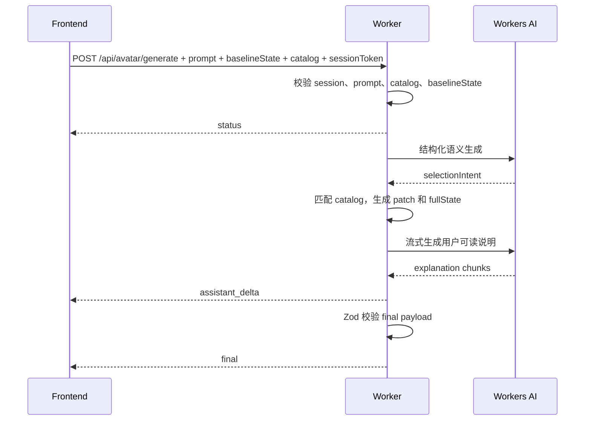
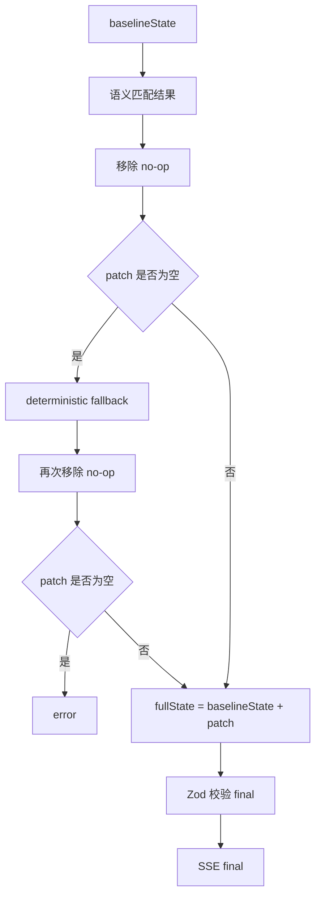

# 04. SSE Agent 协议、语言策略与结构化 schema

## 1. 背景

当前生成链路已经完成安全验证、语义 catalog 驱动和 Worker 端结构化校验，但 SSE 协议仍沿用早期形态：

| 当前字段或事件 | 当前用途 | 问题 |
| --- | --- | --- |
| `final.avatarState` | 前端直接应用的扁平 state patch | 名称像完整状态，无法区分本轮差量与完整头像状态 |
| `final.steps` | 手工教程文本列表 | 只有文本，不便于后续定位选项、渲染图文教程或跳转高亮 |
| `plan_delta` | 流式解释已应用编辑 | 名称偏计划，不符合 agent 对话流式说明语义 |
| `final` 后继续流式输出 | 先应用头像，再补解释 | 成功判定和流式解释顺序不清晰，前端需要处理 final 后仍有数据的情况 |

第 04 步把协议升级为“边聊边生成，最终只看 `final`”的结构：



关键变化：

- `patch` 明确表示本轮差量。
- `fullState` 明确表示可恢复、可保存、可继续作为下一轮上下文的完整头像状态。
- `tutorialSteps` 从纯文本升级为结构化教程步骤。
- `assistant_delta` 替代 `plan_delta`，用于展示 agent 正在分析或解释。
- 成功流最后一个业务事件是 `final`，前端只以 `final.ok === true` 作为成功标准。

## 2. 目标与非目标

### 2.1 目标

- 继续使用 HTTP + SSE，不引入 WebSocket。
- 直接替换旧生成协议，不再设计 `plan_delta`、`final.avatarState`、`final.steps`。
- 固定 SSE 事件为 `status`、`assistant_delta`、`final`、`error`。
- `final` 返回 `patch + fullState + tutorialSteps`。
- `patch` 是相对请求中 `baselineState` 的差量。
- `fullState` 是 `baselineState` 合并 `patch` 后的完整头像 state。
- AI 区域语言跟随用户 prompt 主语言，中文 prompt 输出中文状态、说明、教程和警告。
- 保留当前有排障价值的字段：`summary`、`warnings`、`confidence`、`usedFallback`、`selectionTrace`、`contextMode`、`model`。

### 2.2 非目标

| 非目标 | 说明 |
| --- | --- |
| 本地多轮 conversation thread | 留给第 05 步；本步骤只定义单轮请求和响应协议 |
| Cloudflare Agents SDK | 继续使用当前 Worker HTTP endpoint |
| Durable Object / D1 / R2 | 不新增服务端持久化状态 |
| WebSocket | SSE 已满足单向流式输出 |
| 图文教程完整 UI | 本步骤只返回可渲染的数据结构，复杂 UI 留给后续步骤 |
| 语义 catalog 标注质量提升 | 继续沿用第 03.1 / 03.2 的 semantic catalog 设计 |

## 3. 协议总览

### 3.1 请求体

`POST /api/avatar/generate` 请求体保持现有入口字段：

| 字段 | 类型 | 说明 |
| --- | --- | --- |
| `prompt` | `string` | 用户描述，Worker 按配置限制长度 |
| `contextMode` | `"default" \| "current"` | `@default` 或 `@current` 的上下文模式 |
| `baselineState` | `Record<string, number \| boolean>` | 本轮生成的起点，前端应传完整头像 state |
| `catalog` | `AvatarCatalog` | 前端基于 Rive config 和 semantic catalog 生成的可选项目录 |
| `sessionToken` | `string` | `/api/avatar/session` 返回的短时 AI access token |

`baselineState` 是构造 `patch` 和 `fullState` 的基准：

```text
patch = removeNoopChanges(generatedChanges, baselineState)
fullState = { ...baselineState, ...patch }
```

### 3.2 SSE 事件顺序

成功路径：

```text
status*
assistant_delta*
final
```

失败路径：

```text
status*
assistant_delta*
error
```

规则：

- `status` 可以出现多次。
- `assistant_delta` 可以出现 0 次或多次。
- `final` 只在成功时出现一次，并且是成功流最后一个业务事件。
- `error` 只在失败时出现一次，并且失败后不再发送 `final`。
- 前端不得把 `status` 或 `assistant_delta` 当作生成成功依据。

### 3.3 SSE 事件表

| event | 发送时机 | data 结构 | 前端行为 |
| --- | --- | --- | --- |
| `status` | Worker 阶段切换 | `{ message, phase? }` | 更新 AI 状态行，不改变头像 |
| `assistant_delta` | Agent 流式说明 | `{ text }` | 追加到 AI 流式说明区域 |
| `final` | 全部校验通过后 | `FinalPayload` | 应用 `patch`，保存 `lastFinal`，渲染教程 |
| `error` | 可恢复失败 | `{ ok:false, error, message, details? }` | 展示错误，保留 prompt 和当前头像 |

## 4. `final` schema

### 4.1 字段定义

```ts
type AvatarValue = number | boolean;
type AvatarState = Record<string, AvatarValue>;

type TutorialStep = {
  id: string;
  text: string;
  state?: string;
  value?: AvatarValue;
  optionId?: string;
  tab?: string;
  section?: string;
  kind?: 'feature' | 'color';
  color?: string;
  index?: number;
};

type SelectionTrace = {
  trait: string;
  matchedOptionId: string;
  state: string;
  value: AvatarValue;
  score: number;
  reason: string;
};

type FinalPayload = {
  ok: true;
  contextMode: 'current' | 'default';
  model: string;
  patch: AvatarState;
  fullState: AvatarState;
  tutorialSteps: TutorialStep[];
  summary: string;
  confidence: number;
  warnings: string[];
  usedFallback: boolean;
  selectionTrace: SelectionTrace[];
};
```

### 4.2 字段语义

| 字段 | 语义 | 校验规则 |
| --- | --- | --- |
| `ok` | 成功标记 | 固定为 `true` |
| `contextMode` | 本轮上下文来源 | 只能是 `current` 或 `default` |
| `model` | Worker 使用的模型类别或名称 | 非空字符串 |
| `patch` | 相对 `baselineState` 的差量 | 只允许 catalog 中合法 `state/value`，不得包含 no-op |
| `fullState` | `baselineState` 合并 `patch` 后的完整状态 | 包含完整可序列化头像 state |
| `tutorialSteps` | 可渲染教程步骤 | 最多 12 条，每条必须有 `id` 和 `text` |
| `summary` | 用户可读总结 | 跟随 prompt 主语言 |
| `confidence` | 结果置信度 | `0..1` |
| `warnings` | 可展示警告 | 跟随 prompt 主语言，最多 10 条 |
| `usedFallback` | 是否使用确定性 fallback | boolean |
| `selectionTrace` | 语义匹配排障信息 | DevTools / Debug 使用，不新增可见 Debug UI |

### 4.3 `patch` 与 `fullState`

示例：

```json
{
  "baselineState": {
    "Body": 1,
    "BackgroundColor": 1,
    "Glasses": 0
  },
  "patch": {
    "Body": 5,
    "BackgroundColor": 6
  },
  "fullState": {
    "Body": 5,
    "BackgroundColor": 6,
    "Glasses": 0
  }
}
```

处理规则：

1. Worker 先得到候选编辑结果。
2. Worker 移除与 `baselineState` 相同的 no-op 值。
3. 剩余差量作为 `patch`。
4. Worker 以浅合并构造 `fullState`。
5. 如果 `patch` 为空，进入现有 deterministic fallback。
6. fallback 后仍为空时，返回 `error`，不发送成功 `final`。



### 4.4 `tutorialSteps`

`tutorialSteps` 是后续图文教程和跳转高亮的基础。第一版只要求文本可展示，定位字段可选但应尽量填充。

| 字段 | 必填 | 说明 |
| --- | --- | --- |
| `id` | 是 | 本轮内稳定 id，例如 `step-1` |
| `text` | 是 | 用户可读教程文案 |
| `state` | 否 | 对应 Rive state |
| `value` | 否 | 对应目标值 |
| `optionId` | 否 | semantic catalog 选项 id，例如 `Body:5` |
| `tab` | 否 | UI 标签页名称 |
| `section` | 否 | UI 分组名称 |
| `kind` | 否 | `feature` 或 `color` |
| `color` | 否 | 色值，仅颜色步骤使用 |
| `index` | 否 | 选项在分组内的序号 |

英文示例：

```json
{
  "id": "step-1",
  "text": "Open Body, find Body, then choose option 2.",
  "state": "Body",
  "value": 5,
  "optionId": "Body:5",
  "tab": "Body",
  "section": "Body",
  "kind": "feature",
  "index": 1
}
```

中文示例：

```json
{
  "id": "step-1",
  "text": "打开 Body，找到 Body 分组，然后选择第 2 个选项。",
  "state": "Body",
  "value": 5,
  "optionId": "Body:5",
  "tab": "Body",
  "section": "Body",
  "kind": "feature",
  "index": 1
}
```

## 5. 语言策略

### 5.1 判定规则

Worker 在归一化 prompt 后判定主语言：

| 条件 | 语言 |
| --- | --- |
| 包含中文、日文或韩文字符，且中文字符占主要比例 | 中文 |
| 明确英文 prompt | 英文 |
| 中英混合且中文表达为主 | 中文 |
| 无法判断 | 英文 |

第一版只需要区分中文和英文。后续如果需要更多语言，再扩展 `language` 枚举和文案模板。

### 5.2 覆盖范围

以下 AI 区域文案必须跟随用户 prompt 主语言：

- `status.message`
- `assistant_delta.text`
- `final.summary`
- `final.tutorialSteps[].text`
- `final.warnings[]`
- `error.message`

不要求翻译内部字段：

- `state`
- `value`
- `optionId`
- `selectionTrace.reason`
- `model`
- `error`

### 5.3 prompt 约束

结构化语义生成 prompt 应明确：

- 输出用户可读文本时使用用户 prompt 主语言。
- 中文请求输出中文总结、教程和警告。
- 不提 API、schema、state id 等实现细节。
- 对真实或虚构人物只做风格化近似，不承诺精确还原。

## 6. Worker 设计要点

### 6.1 类型与校验

Worker 应新增或替换 Zod schema：

```ts
const tutorialStepSchema = z.object({
  id: z.string().min(1),
  text: z.string().min(1),
  state: z.string().optional(),
  value: avatarValueSchema.optional(),
  optionId: z.string().optional(),
  tab: z.string().optional(),
  section: z.string().optional(),
  kind: z.enum(['feature', 'color']).optional(),
  color: z.string().optional(),
  index: z.number().finite().optional(),
}).strict();

const sseFinalPayloadSchema = z.object({
  ok: z.literal(true),
  contextMode: z.enum(['current', 'default']),
  model: z.string().min(1),
  patch: avatarStateSchema,
  fullState: avatarStateSchema,
  tutorialSteps: z.array(tutorialStepSchema).max(12),
  summary: z.string(),
  confidence: z.number().min(0).max(1),
  warnings: z.array(z.string()).max(10),
  usedFallback: z.boolean(),
  selectionTrace: z.array(selectionTraceSchema),
}).strict();
```

旧字段处理：

| 旧字段或事件 | 第 04 步处理 |
| --- | --- |
| `SseEvent = 'plan_delta'` | 替换为 `assistant_delta` |
| `final.avatarState` | 替换为 `final.patch` |
| `final.steps` | 替换为 `final.tutorialSteps` |
| 流式解释在 `final` 后发送 | 改为 `assistant_delta` 在 `final` 前发送 |

### 6.2 结果构造流程

Worker 生成结果时按以下顺序处理：

1. 校验请求、session、prompt、catalog。
2. 判定用户 prompt 主语言。
3. 调用结构化语义生成，得到 `selectionIntent`。
4. 用 semantic catalog 匹配合法选项。
5. 得到 `candidatePatch` 和 `selectionTrace`。
6. 移除 no-op，得到 `patch`。
7. 如果 `patch` 为空，执行 deterministic fallback。
8. 构造 `fullState = { ...baselineState, ...patch }`。
9. 根据 `patch` 和 catalog 构造 `tutorialSteps`。
10. 生成或整理 `summary`、`warnings`、`confidence`。
11. 先发送必要 `status` 和 `assistant_delta`。
12. 用 Zod 校验 `final`。
13. 发送唯一成功 `final` 并关闭 stream。

### 6.3 SSE 发送顺序

推荐阶段：

| phase | `status.message` 英文 | `status.message` 中文 |
| --- | --- | --- |
| `validate_context` | `Reading avatar context...` | `正在读取头像上下文...` |
| `build_traits` | `Generating structured avatar traits...` | `正在生成结构化头像特征...` |
| `validate_result` | `Validating editable avatar changes...` | `正在校验可编辑头像改动...` |
| `write_explanation` | `Writing the editable guide...` | `正在编写可编辑教程...` |

示例 SSE：

```text
event: status
data: {"phase":"validate_context","message":"正在读取头像上下文..."}

event: assistant_delta
data: {"text":"我会保留当前头像结构，并调整服装和背景。"}

event: final
data: {"ok":true,"contextMode":"current","model":"workers-ai","patch":{"Body":5},"fullState":{"Body":5,"BackgroundColor":1},"tutorialSteps":[{"id":"step-1","text":"打开 Body，找到 Body 分组，然后选择第 2 个选项。","state":"Body","value":5}],"summary":"已生成一个更有力量感的可编辑头像。","confidence":0.82,"warnings":[],"usedFallback":false,"selectionTrace":[]}
```

### 6.4 错误处理

`error` payload：

```ts
type ErrorPayload = {
  ok: false;
  error: string;
  message: string;
  details?: unknown;
};
```

规则：

- 请求级错误继续使用 JSON response，例如 `invalid_json`、`session_required`。
- SSE 已开始后发生错误，发送 `error` 事件。
- `error.message` 跟随用户 prompt 主语言。
- 发送 `error` 后关闭 stream。
- 不发送半成品 `final`。

## 7. 前端设计要点

### 7.1 SSE 消费

前端 `handleGenerationEvent()` 应改为：

| event | 行为 |
| --- | --- |
| `status` | 更新 `aiStatus` |
| `assistant_delta` | 追加到 `aiStream` |
| `final` | 保存 `window.avatarGenerationDebug.lastFinal`，应用 `patch`，渲染 `tutorialSteps` |
| `error` | 抛出错误并显示 message |

### 7.2 应用头像状态

前端应优先应用 `final.patch`：

```text
applied = applyGeneratedAvatarState(final.patch)
```

应用后可用本地当前 state 与 `final.fullState` 做轻量一致性检查：

```text
for each key in final.fullState:
  currentInputValues[key] should equal final.fullState[key]
```

如果不一致：

- 保留已应用的合法 patch。
- 显示 warning 或状态提示。
- 记录到 `window.avatarGenerationDebug.lastFinal`，方便排查。

### 7.3 教程渲染

`renderAiResult()` 应从 `result.tutorialSteps` 读取：

```text
for step in tutorialSteps:
  render step.text
```

后续第 07 步可以继续使用 `state/value/optionId/tab/section/index` 做：

- 目标选项定位。
- 跳转到对应 tab。
- 高亮目标 tile 或 swatch。
- 渲染图文教程。

### 7.4 Debug 数据

继续保留：

```js
window.avatarGenerationDebug.lastFinal = data;
```

`lastFinal` 应保存完整 `FinalPayload`，包括：

- `patch`
- `fullState`
- `tutorialSteps`
- `selectionTrace`
- `warnings`

## 8. 测试计划

### 8.1 Worker 单测

| 场景 | 预期 |
| --- | --- |
| 有效生成 | SSE 包含 `status`、可选 `assistant_delta`、最后 `final` |
| 旧事件移除 | 不再发送 `plan_delta` |
| final schema | 包含 `patch/fullState/tutorialSteps`，不包含 `avatarState/steps` |
| patch 语义 | `patch` 只包含相对 `baselineState` 的差量 |
| fullState 语义 | `fullState` 等于 `baselineState` 合并 `patch` |
| 空 patch | 进入 deterministic fallback |
| fallback 仍为空 | 发送 `error`，不发送 `final` |
| 中文 prompt | `status`、`assistant_delta`、`summary`、`tutorialSteps`、`warnings` 为中文 |
| 脏模型输出 | 非法 state/value 不进入 `patch` 或 `fullState` |
| final 顺序 | 成功流最后一个事件是 `final` |

### 8.2 前端 E2E

| 场景 | 预期 |
| --- | --- |
| mock SSE `assistant_delta` | AI stream 展示流式文本 |
| mock SSE `final.patch` | 头像状态被应用 |
| mock SSE `final.tutorialSteps` | 手工教程列表展示 step text |
| undo/redo | 生成后的 patch 仍进入历史栈 |
| debug | `window.avatarGenerationDebug.lastFinal.patch` 可读 |
| fullState 检查 | 应用 patch 后当前状态与 fullState 对应字段一致 |

### 8.3 静态与类型检查

实现完成后至少运行：

```bash
npm run test:worker
npx tsc -p tsconfig.worker.json --noEmit
npm run build:site
npm run test:static
git diff --check
```

有浏览器环境时继续运行：

```bash
npm run test:e2e
```

## 9. 验收标准

- `/api/avatar/generate` 成功流最后一个业务事件是 `final`。
- Worker 不再发送 `plan_delta`。
- `assistant_delta` 可被前端流式展示。
- `final` 不再包含 `avatarState` 和 `steps`。
- `final.patch` 是相对 `baselineState` 的差量。
- `final.fullState` 是完整头像 state。
- `final.tutorialSteps` 可直接渲染为教程列表，并包含后续定位所需字段。
- 中文 prompt 的 AI 区域文案为中文。
- 前端应用 `patch` 后，当前头像状态与 `fullState` 对应字段一致。
- `window.avatarGenerationDebug.lastFinal` 保存完整结构化结果。
