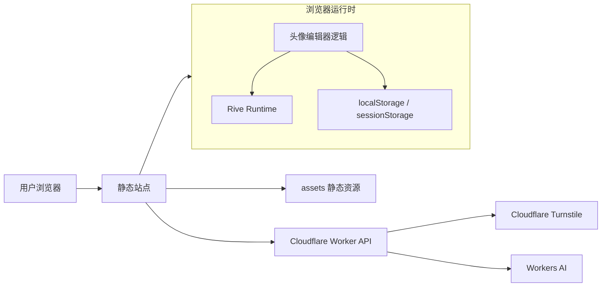
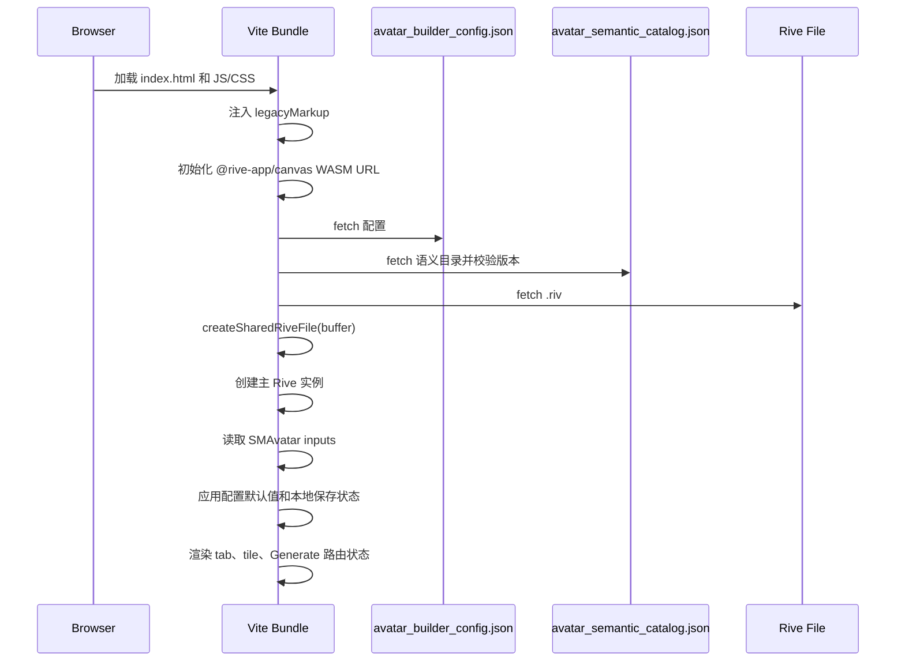
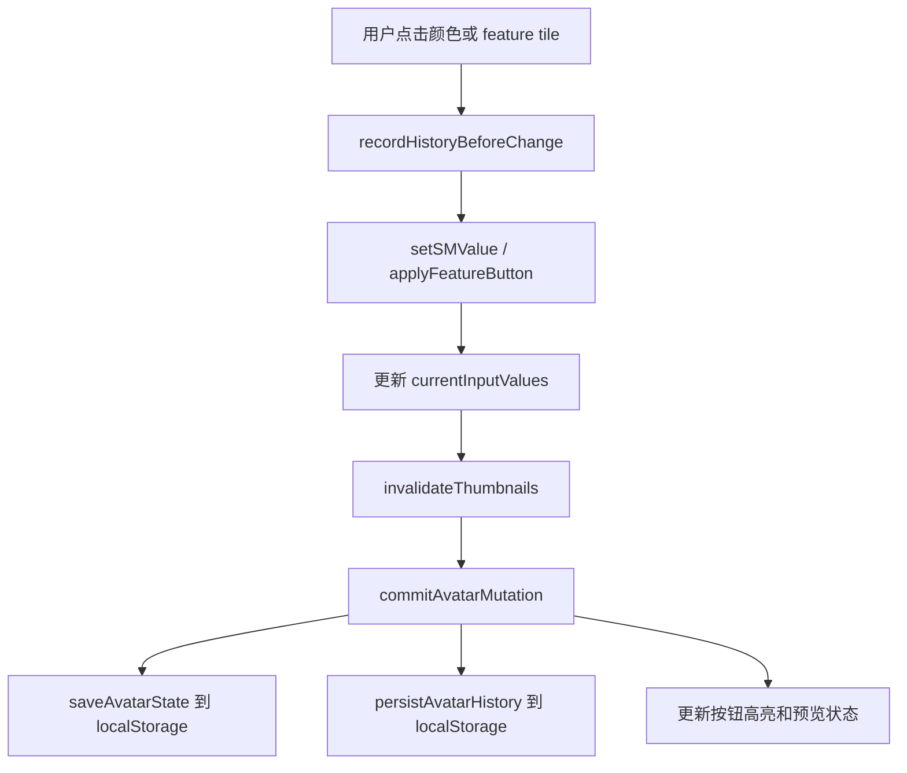
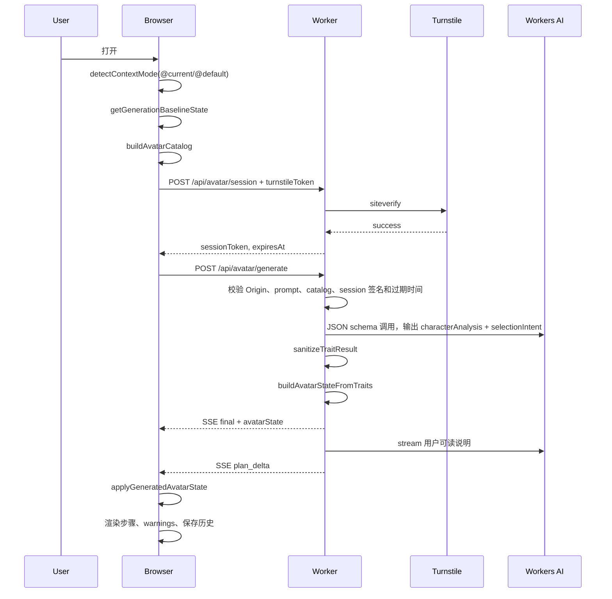
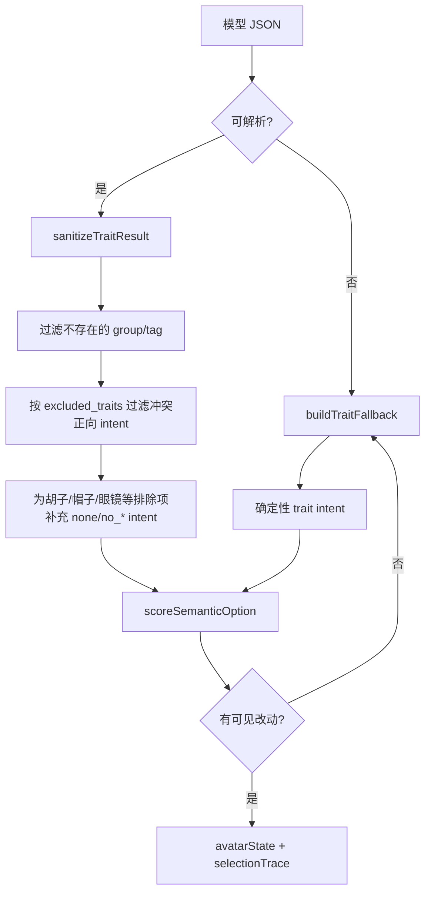
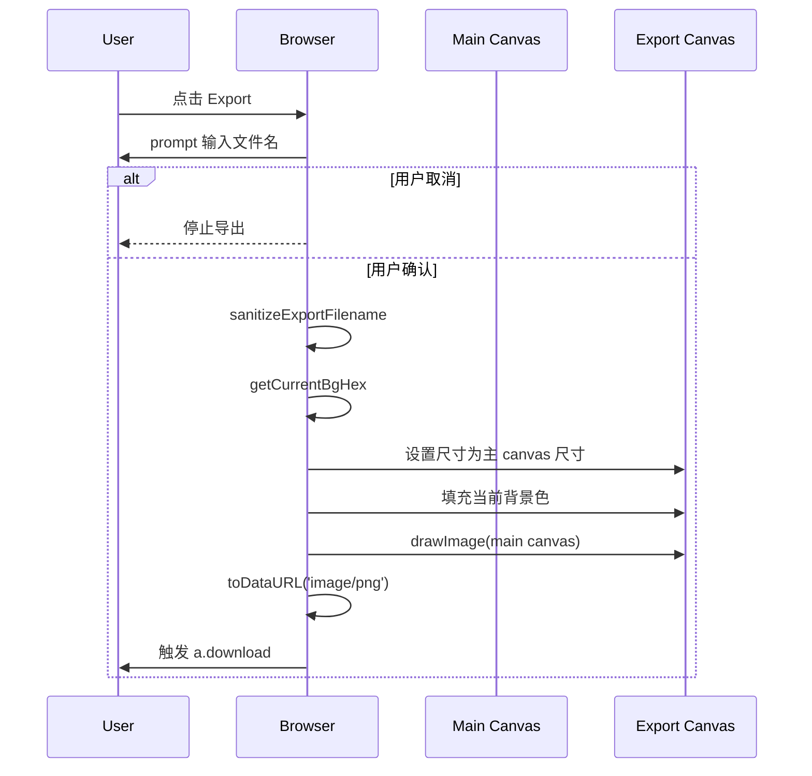

# 项目当前整体架构

## 1. 总览

本项目是一个基于 Rive 的多邻国风格头像编辑器，前端以静态站点发布，AI 生成能力由 Cloudflare Worker 代理 Workers AI 完成。浏览器负责加载 Rive、渲染头像、维护本地编辑状态和导出 PNG；Worker 负责 Turnstile 校验、短时会话签名、Prompt 编排、结构化语义匹配和 SSE 返回。



| 层 | 主要文件 | 职责 |
| --- | --- | --- |
| React 入口 | `src/App.tsx`, `src/main.tsx` | 挂载旧版 HTML 字符串并异步加载编辑器运行时 |
| 旧版编辑器 UI | `src/legacy/legacyMarkup.ts` | 提供页面骨架、按钮、画布、Generate 页面和弹层容器 |
| 旧版编辑器逻辑 | `src/legacy/avatarExplorer.ts` | Rive 加载、状态管理、缩略图、Generate、Export、Undo/Redo、测试 hooks |
| 样式 | `src/styles.css` | 桌面/移动布局、编辑面板、Generate 页面、弹层和按钮样式 |
| 静态资源 | `assets/*` | Rive 文件、头像配置、语义目录、图标、manifest |
| Worker API | `worker/index.ts` | `/api/config`、AI session、Generate SSE、CORS、Turnstile、Workers AI |
| 测试 | `tests/*` | Worker 单测、静态构建检查、CDP 浏览器集成测试 |
| 语义工具 | `scripts/semantic_catalog.py`, `scripts/semantic_codex.py` | 构建、校验和人工合并头像语义目录 |

## 2. 运行时结构

```text
index.html
  -> React App
    -> legacyMarkup 静态 HTML
    -> avatarExplorer.ts
      -> @rive-app/canvas + WASM
      -> avatar_builder_config.json
      -> avatar_semantic_catalog.json
      -> avatar_builder_25_sept2025.riv
      -> Cloudflare Worker API
```

编辑器使用一个主 Rive 实例渲染大头像，使用多个轻量 Rive 实例渲染当前 tab 的 feature tile 缩略图。所有实例共享同一个 `RiveFile`，避免重复解析 `.riv` 文件。

| 运行时状态 | 位置 | 说明 |
| --- | --- | --- |
| `riveInst` | 浏览器内存 | 主头像 Rive 实例 |
| `sharedRiveFile` | 浏览器内存 | 所有主画布和缩略图共享的 Rive 文件 |
| `stateMachineInputs` | 浏览器内存 | `SMAvatar` 的输入映射 |
| `currentInputValues` | 浏览器内存 | 当前头像可序列化状态 |
| `defaultInputValues` | 浏览器内存 | 从配置默认值计算出的默认头像 |
| `tileInstances` | 浏览器内存 | 当前已创建的 tile 缩略图 Rive 实例 |
| `dirtyTabs` | 浏览器内存 | 需要重建缩略图的 tab |
| `avatarHistory` | `localStorage` | Undo/Redo 历史，最多 30 步 |
| `aiSession` | `sessionStorage` | Turnstile 换取的短时 AI session |

## 3. 初始化流程



初始化关键点：

- `loadBackendConfig()` 会异步读取 Worker `/api/config`，失败时编辑器仍可手动使用，只禁用 AI Generate。
- `loadSemanticCatalog()` 要求 `semanticVersion = 1` 且 `sourceVersion` 与 Rive 配置版本一致，否则 Generate 禁用。
- `onMainLoaded()` 会先应用默认值，再应用本地保存头像，最后加载历史栈并渲染 UI。
- tile 缩略图按当前 tab 懒加载，并以 batch 方式创建，避免一次性阻塞主线程。

## 4. 编辑与状态保存流程



| 操作 | 是否写历史 | 是否保存本地头像 | 是否刷新缩略图 |
| --- | --- | --- | --- |
| 手动选择单个 state | 是 | 是 | 是，非当前 tab 标脏 |
| feature button 批量覆盖 | 是，批量前记录一次 | 是 | 是 |
| AI 生成应用结果 | 是 | 是 | 是，全部 tab 标脏 |
| Undo/Redo | 使用历史栈，不新增历史 | 是 | 是 |
| Reset | 默认记录，清空自定义状态 | 是 | 是 |
| Export | 否 | 否 | 否 |

## 5. Generate 完整流程

Generate 的目标不是输出一张不可编辑图片，而是输出“可继续编辑的 Rive state patch”。模型只负责描述目标语义，最终 state 值由 Worker 根据语义目录匹配，避免模型直接写内部状态号。



### 5.1 浏览器请求体

| 字段 | 来源 | 说明 |
| --- | --- | --- |
| `prompt` | Generate textarea | 用户描述，前端不保存 |
| `contextMode` | `@current` / `@default` | 默认 `default` |
| `baselineState` | 当前头像或默认头像 | Worker 输出相对于该状态的可见改动 |
| `catalog` | `buildAvatarCatalog()` | 配置状态集合 + 语义目录 options |
| `sessionToken` | `/api/avatar/session` | HMAC 签名短时 token |

### 5.2 Worker 结构化输出

Worker 要求模型返回紧凑 JSON：

| 字段 | 作用 |
| --- | --- |
| `characterAnalysis` | 结构化角色分析对象，包含类型、身份、核心视觉特征和必须排除的特征 |
| `summary` | 可选生成摘要 |
| `confidence` | 可选 0-1 置信度 |
| `selectionIntent` | `{ group, tags, required }[]`，只能使用语义目录里的 group/tag |
| `warnings` | 无法表达或近似表达的说明 |

`characterAnalysis` 结构：

| 字段 | 说明 |
| --- | --- |
| `type` | `real_person`、`fictional_character`、`occupation`、`generic` |
| `identity` | 识别出的人物、角色或职业身份 |
| `core_visual_traits` | 3-5 个核心视觉特征，例如短黑发、圆眼镜、蓝色上衣 |
| `excluded_traits` | 必须不存在的特征，例如胡子、帽子、成人特征、通用侦探帽 |

当前 Prompt 规则强调：

- 具体角色优先于职业刻板印象：如“江户川柯南”按柯南设定，不按普通侦探生成帽子、烟斗或胡子。
- 年龄/性别一致：儿童或女性默认排除胡子，除非该具体角色官方设定确实有。
- 强制排除法：模型必须先列出 `excluded_traits`，后续选择不得与排除项冲突。
- 关键配饰优先：如柯南的眼镜，taxonomy 支持时必须标记为 required。
- 真实/公众人物必须按真实照片或经典形象对齐，不得凭空添加帽子、眼镜、胡子等特征。
- 职业/身份角色必须使用标志性服饰或道具；牛仔必须优先匹配帽子类 headwear。
- 虚构/动漫角色按官方设定选择可表达特征。

### 5.3 语义匹配与 fallback



fallback 仍不直接写 state 值，而是生成 trait intent，再走同一套语义匹配。当前内置了少量高风险角色兜底：

| 输入识别 | 必选/优先 trait |
| --- | --- |
| `Obama` / `Barack` / `奥巴马` | `skin_tone: dark,brown`、短发、无胡子、无眼镜、无帽 |
| `鲁迅` / `Lu Xun` | 短发、一字胡/胡子、深色胡子、无帽 |
| `cowboy` / `western` / `牛仔` | 帽子类 headwear、可选粗犷胡须、深色衣服 |

## 6. Export 完整流程

Export 只导出当前浏览器画布，不调用 Worker，不上传文件，不改变头像状态。



文件名规则：

| 输入 | 输出 |
| --- | --- |
| `report.png` | `report.png` |
| `my/avatar: test?` | `my_avatar__test_.png` |
| 空字符串 | 默认 `avatar_<timestamp>.png` |
| 取消 prompt | 不导出 |

## 7. Worker API

| 路径 | 方法 | 返回 | 说明 |
| --- | --- | --- | --- |
| `/health` | `GET` | JSON | 服务名和版本 |
| `/api/config` | `GET` | JSON | AI 功能开关、Turnstile site key、session TTL、端点 |
| `/api/avatar/session` | `POST` | JSON | Turnstile token 换短时 AI session |
| `/api/avatar/generate` | `POST` | SSE | 返回 `status`、`final`、`plan_delta`、`error` |
| `OPTIONS *` | `OPTIONS` | 空响应 | CORS preflight |

安全边界：

- Worker 只允许白名单 Origin：GitHub Pages、Cloudflare Pages、本地开发地址。
- 前端只拿公开 Turnstile site key；secret key 和 AI binding 只在 Worker 环境中。
- `sessionToken` 使用 HMAC 签名，校验签名、过期时间、Origin 和 issuer。
- Worker 在返回前使用 Zod 校验最终 SSE `final` payload。
- 模型不能直接设置任意 Rive state；所有 state/value 必须来自 catalog。

## 8. 测试与发布

| 命令 | 覆盖范围 |
| --- | --- |
| `npm run test:worker` | Worker API、session、Generate SSE、Prompt/schema、fallback、语义匹配 |
| `npm run test:static` | Vite 构建、静态资源、manifest、本地引用、Rive WASM |
| `python3 tests/test_avatar_explorer.py` | 浏览器集成：Rive、缩略图、移动布局、AI mock、导出文件名 |
| `npm run test:ci` | 静态、Worker、浏览器完整验证 |
| `npm run deploy:cf:pages` | 发布 `_site` 到 Cloudflare Pages |
| `npm run deploy:cf:worker` | 发布 Worker |

发布前应至少完成与改动范围匹配的验证。修改文档、实现计划或修复问题后，按协作规则提交 commit 并 push。
