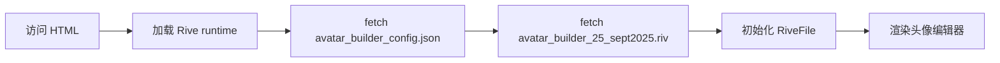
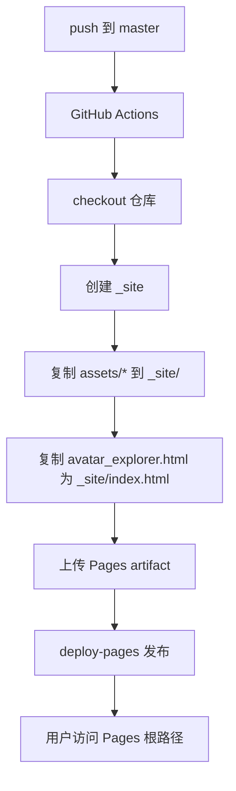
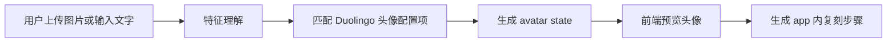
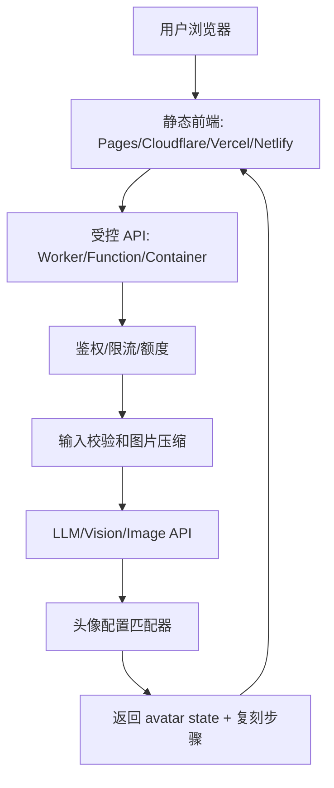
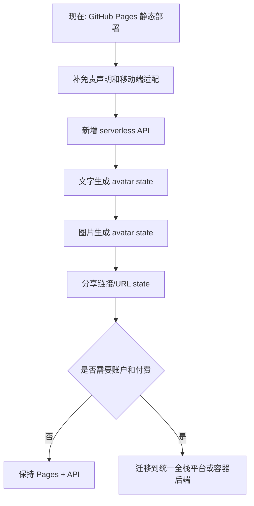
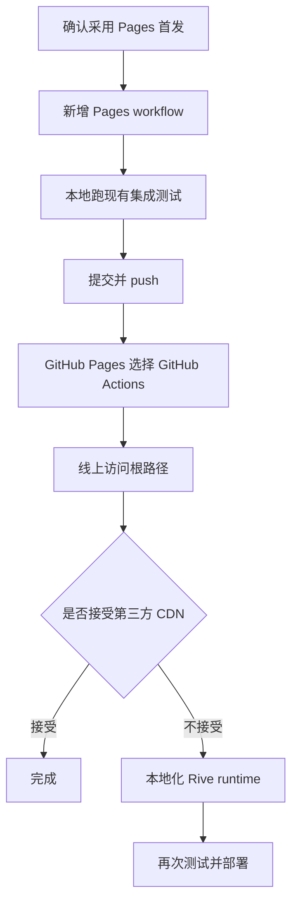

# Duolingo Avatar Creator 部署方案评估

## 1. 结论

当前项目可以按纯前端静态站点部署，不需要先容器化。

首选方案是 **GitHub Pages + GitHub Actions 自定义工作流**：把 `assets/` 目录打包成 Pages artifact，并在部署产物根目录生成 `index.html`，这样最终可以通过项目 Pages 根路径直接访问：

```text
https://wishflow.github.io/duolingo-avator-creator/
```

容器方案也可行，但更适合需要自有服务器、内网部署、自定义 HTTP 缓存/安全头、统一容器发布链路的场景。对当前项目来说，容器不是最小方案。

## 2. 项目现状

| 维度 | 现状 | 部署影响 |
| --- | --- | --- |
| 前端入口 | `assets/avatar_explorer.html` | 不是 `index.html`，直接部署根目录时需要重命名或生成入口 |
| 构建系统 | `package.json` 无 `scripts`，无 Vite/Webpack 构建流程 | 可以直接静态部署，无需 Node 构建 |
| 运行时资源 | 页面通过相对路径加载 `avatar_builder_config.json`、`.riv`、SVG | 只要保持这些文件与 HTML 的相对路径即可 |
| Rive runtime | HTML 里引用 `https://unpkg.com/@rive-app/canvas@2.37.8/rive.js` | Pages 可用，但依赖第三方 CDN；可选本地化 |
| 静态资源大小 | `assets/` 约 3.1 MB，仓库约 6.5 MB | 远低于 GitHub Pages 站点 1 GB 限制 |
| 本地访问要求 | README 说明需要 HTTP 服务，不能直接 `file://` | GitHub Pages/容器都满足 HTTP 访问 |
| 自动化测试 | `tests/test_avatar_explorer.py` 启动本地 HTTP + headless Chrome | 部署前可继续用现有测试做回归 |

当前 HTML 初始化逻辑如下：



## 3. 外部约束

GitHub Pages 官方文档确认：

- GitHub Pages 用于托管静态 HTML/CSS/JavaScript，也可以通过 Actions 执行构建后发布。
- 分支发布源只能选择仓库根目录 `/` 或 `/docs`。
- 如果使用 Actions 发布，部署 artifact 顶层需要有入口文件，例如 `index.html`。
- GitHub Pages 不支持服务端语言，例如 PHP、Ruby、Python。
- Pages 公开站点有容量、构建时长、带宽等软限制；当前项目体积很小，不构成问题。

另外，本项目是 Duolingo 头像编辑器的反向研究/复刻项目。公开部署前建议在页面或 README 中增加明显声明：本项目非 Duolingo 官方项目，仅用于学习/研究，不收集用户数据。

## 4. 可行方案对比

| 方案 | 访问路径 | 改动量 | 优点 | 缺点 | 适用判断 |
| --- | --- | --- | --- | --- | --- |
| A. GitHub Pages + Actions 打包 `assets/` | `/duolingo-avator-creator/` | 小 | 根路径可直接访问；不污染源码目录；不需要构建框架 | 需要新增 GitHub Actions workflow；默认仍依赖 unpkg | 推荐首选 |
| B. GitHub Pages 从 `master` 根目录发布 | `/duolingo-avator-creator/assets/avatar_explorer.html` | 极小 | 几乎不用改代码 | 根路径会优先看到 README/非应用入口；路径不够友好 | 只适合临时预览 |
| C. GitHub Pages + Actions + 本地化 Rive runtime | `/duolingo-avator-creator/` | 中 | 不依赖 unpkg/jsDelivr；可控性更高 | 需要复制 `rive.js`、`rive.wasm`、`rive_fallback.wasm` 并调整 runtime URL | 推荐作为第二阶段增强 |
| D. Nginx 静态容器 | 自定义域名或服务器地址 | 中 | 部署到任意容器平台；可配置缓存、安全头、访问控制 | 需要容器宿主或平台；对纯静态公开访问偏重 | 有现成容器平台时使用 |
| E. 第三方静态托管（Cloudflare Pages/Netlify 等） | 平台分配或自定义域名 | 小到中 | 静态托管能力强；配置灵活 | 引入额外平台账号和配置 | 如果不想用 GitHub Pages 可考虑 |

## 5. 推荐方案：GitHub Pages + Actions

### 5.1 目标

把仓库里的 `assets/` 作为静态站点根目录发布，并在发布产物中把 `avatar_explorer.html` 复制为 `index.html`。



### 5.2 计划改动

新增：

```text
.github/workflows/pages.yml
```

工作流核心逻辑：

```yaml
name: Deploy static site to GitHub Pages

on:
  push:
    branches: [master]
  workflow_dispatch:

permissions:
  contents: read
  pages: write
  id-token: write

concurrency:
  group: pages
  cancel-in-progress: false

jobs:
  deploy:
    runs-on: ubuntu-latest
    environment:
      name: github-pages
      url: ${{ steps.deployment.outputs.page_url }}
    steps:
      - uses: actions/checkout@v6

      - uses: actions/configure-pages@v5

      - name: Prepare static site
        run: |
          mkdir -p _site
          cp -R assets/* _site/
          cp assets/avatar_explorer.html _site/index.html
          touch _site/.nojekyll

      - uses: actions/upload-pages-artifact@v4
        with:
          path: _site

      - id: deployment
        uses: actions/deploy-pages@v4
```

GitHub 仓库设置：

1. 打开仓库 `Settings`。
2. 进入 `Pages`。
3. `Build and deployment` 的 `Source` 选择 `GitHub Actions`。
4. push 后在 `Actions` 查看部署结果。

### 5.3 为什么不直接用分支根目录发布

如果直接设置 `master` + `/`：

```text
https://wishflow.github.io/duolingo-avator-creator/
```

会以仓库根目录为站点根。当前根目录没有应用入口 `index.html`，但有 `README.md`，因此根路径不一定会进入头像编辑器。真实应用路径会变成：

```text
https://wishflow.github.io/duolingo-avator-creator/assets/avatar_explorer.html
```

这能访问，但不符合“直接访问”的目标。

### 5.4 验证方式

部署前本地验证：

```bash
python3 tests/test_avatar_explorer.py --port 8775 --debug-port 9228
```

部署后线上验证：

| 检查项 | 预期 |
| --- | --- |
| 根路径访问 | `https://wishflow.github.io/duolingo-avator-creator/` 打开头像编辑器 |
| 静态资源 | `avatar_builder_config.json`、`.riv`、SVG 全部 200 |
| Rive runtime | `rive.js`、`rive.wasm` 正常加载 |
| 页面功能 | 默认头像渲染、切换 tab、选择 tile、导出 PNG |
| 浏览器控制台 | 无 404、CORS、WASM 初始化失败 |

## 6. 第二阶段增强：本地化 Rive runtime

当前页面依赖：

```html
<script src="https://unpkg.com/@rive-app/canvas@2.37.8/rive.js"></script>
```

本地 `node_modules/@rive-app/canvas/` 已包含：

```text
rive.js
rive.wasm
rive_fallback.wasm
```

如果要消除第三方 CDN 依赖，可以改为：

```text
assets/vendor/rive/rive.js
assets/vendor/rive/rive.wasm
assets/vendor/rive/rive_fallback.wasm
```

并在页面中使用本地脚本和 WASM 地址：

```html
<script src="vendor/rive/rive.js"></script>
<script>
window.rive.RuntimeLoader.setWasmUrl('vendor/rive/rive.wasm');
window.rive.RuntimeLoader.setWasmFallbackUrl('vendor/rive/rive_fallback.wasm');
</script>
```

收益：

- 页面不依赖 unpkg/jsDelivr 可用性。
- 版本完全由仓库锁定。
- GitHub Pages、容器、离线内网部署表现一致。

代价：

- 仓库增加约 4.1 MB 静态文件。
- 后续升级 `@rive-app/canvas` 时需要同步更新 vendored 文件。

## 7. 容器方案

如果后续需要部署到自有服务器、Kubernetes、Render/Fly.io/Railway 等容器平台，可以新增 Nginx 静态镜像。

### 7.1 Dockerfile 草案

```dockerfile
FROM nginx:1.27-alpine

COPY assets/ /usr/share/nginx/html/
COPY assets/avatar_explorer.html /usr/share/nginx/html/index.html
```

本地运行：

```bash
docker build -t duolingo-avatar-creator .
docker run --rm -p 8080:80 duolingo-avatar-creator
```

访问：

```text
http://127.0.0.1:8080/
```

### 7.2 GHCR 发布草案

如果要把镜像发布到 GitHub Container Registry，可新增：

```text
.github/workflows/container.yml
```

核心要点：

- `permissions.packages: write`
- 使用 `docker/login-action` 登录 `ghcr.io`
- 使用 `docker/metadata-action` 生成标签
- 使用 `docker/build-push-action` 构建并推送镜像

### 7.3 容器方案取舍

| 问题 | 判断 |
| --- | --- |
| 当前是否需要服务端逻辑 | 不需要 |
| 当前是否需要私有访问控制 | 未体现 |
| 当前是否需要自定义响应头 | 未体现 |
| 当前是否有容器平台承载 | 未体现 |
| 当前是否值得引入镜像构建和运行维护 | 暂不值得 |

所以容器方案建议作为后备，不作为首发。

## 8. 未来 AI/LLM 功能下的部署再评估

### 8.1 未来目标拆解

未来目标不是单纯展示静态头像编辑器，而是增加一条 AI 辅助链路：



这条链路可以拆成 5 类能力：

| 能力 | 说明 | 是否必须有服务端 |
| --- | --- | --- |
| 文本理解 | 从文字描述中提取肤色、发型、眼睛、胡子、帽子、衣服、背景等目标特征 | 如果使用自己的 LLM Key，则必须 |
| 图片理解 | 从上传图片中分析可见特征 | 如果使用云端视觉模型，则必须 |
| 配置匹配 | 把模型输出映射到 `avatar_builder_config.json` 中真实存在的选项 | 可前端，也可后端 |
| 步骤生成 | 输出“在 app 中依次点击哪个 tab、哪个选项”的复刻说明 | 可前端模板化，也可 LLM 辅助 |
| 历史/账户/分享 | 保存用户生成记录、跨设备同步、登录、额度 | 需要后端或 BaaS |

对当前 Rive 编辑器来说，更合理的第一阶段不是“生成一张新头像图片”，而是“生成可复刻的头像状态 JSON”：

```json
{
  "state": {
    "SkinColor": 4,
    "HairStyle": 12,
    "HairColor": 2,
    "ShirtColor": 5,
    "BackgroundColor": 3
  },
  "steps": [
    "打开 Body，选择第 4 个肤色",
    "打开 Hair，选择第 12 个发型和第 2 个发色",
    "打开 Shirt，选择第 5 个颜色",
    "打开 BG，选择第 3 个背景"
  ],
  "confidence": 0.82
}
```

这样可以最大化复用现有应用，不需要先做复杂图片合成，也不会生成无法在 Duolingo app 内复刻的结果。

### 8.2 对纯 GitHub Pages 的影响

纯 GitHub Pages 仍然适合承载静态前端，但不适合直接承载未来 AI 调用。

| 场景 | 纯 GitHub Pages 是否可行 | 原因 |
| --- | --- | --- |
| 当前静态编辑器 | 可行 | 只需要 HTML/CSS/JS/JSON/Rive 静态资源 |
| 前端内置你的 LLM API Key | 不可行 | 浏览器代码和网络请求都能被用户看到，Key 会泄露 |
| 用户自己输入自己的 API Key | 技术上可行，但只适合个人原型 | Key 会被页面 JS 读取，用户必须完全信任站点；体验差，也无法统一限流 |
| GitHub Pages 前端 + 外部后端 API | 可行 | Pages 只负责 UI，后端保存 Key 并代理 LLM 请求 |
| 图片上传到 GitHub Pages | 不可行 | Pages 没有运行时存储和服务端处理能力 |
| 完整 AI SaaS | 不建议只用 Pages | GitHub Pages 官方限制不适合商业 SaaS 或敏感交易；本项目还涉及学习复刻声明和用户数据问题 |

核心安全结论：

- 不要把 `OPENAI_API_KEY`、Anthropic Key、Google API Key、Replicate Token 等任何付费 API Key 写进前端代码、构建产物、GitHub Actions 日志或公开仓库。
- 即使在 GitHub Pages 的 Actions 中配置 secret，也只能用于构建时；如果把 secret 注入前端 JS，最终仍会暴露给浏览器。
- CORS 不是 Key 保护机制。攻击者可以绕过浏览器，直接调用 API 或复制前端请求。

OpenAI 官方 Key 安全建议明确要求：不要在浏览器或移动端等客户端环境暴露 API Key，生产请求应经过自己的后端；Key 应使用环境变量或密钥管理服务加载。

### 8.3 推荐目标架构

未来建议采用“静态前端 + 受控 API 后端”的架构。



建议接口形态：

```text
POST /api/generate-avatar
Content-Type: application/json

{
  "mode": "text | image",
  "prompt": "short description",
  "image": "base64 data url or uploaded file id",
  "locale": "zh-CN"
}
```

返回：

```text
200 OK

{
  "avatarState": {...},
  "steps": [...],
  "explanation": "...",
  "confidence": 0.82,
  "warnings": [...]
}
```

后端职责边界：

| 职责 | 必要性 | 说明 |
| --- | --- | --- |
| API Key 保管 | 必须 | 使用平台 secret/env，不进仓库，不下发到浏览器 |
| 请求限流 | 必须 | 按 IP、匿名 session、登录用户或 Turnstile/CAPTCHA 限制滥用 |
| 成本控制 | 必须 | 限制图片大小、请求频率、每日额度、模型档位 |
| 输入校验 | 必须 | MIME、文件大小、尺寸、base64 长度、JSON schema |
| 输出校验 | 必须 | LLM 输出必须被校验成合法 avatar state，不能直接信任 |
| 日志脱敏 | 必须 | 不记录原图、不记录完整 Key、不记录敏感提示词 |
| 图片生命周期 | 必须 | 默认不持久化；如需存储，设置过期清理 |
| 多端同步 | 可选 | 需要账户、数据库或可分享 URL |

### 8.4 部署方案重新对比

| 方案 | 易用性 | Key 安全 | 服务器安全 | 上传图片 | 多端使用 | 适用阶段 | 结论 |
| --- | --- | --- | --- | --- | --- | --- | --- |
| 纯 GitHub Pages | 最高 | 差，不能保存你的 Key | 好，几乎无服务器面 | 只能本地预览，不能安全处理 | 可访问，但无同步 | 当前静态版 | 当前可用，未来 AI 不够 |
| GitHub Pages + Cloudflare Worker | 较高 | 好，Key 在 Worker secret | 好，免维护服务器 | 可处理小图；大图建议 R2/签名上传 | 可访问；同步需 KV/D1/R2 | AI MVP | 推荐 |
| GitHub Pages + Vercel/Netlify Function | 高 | 好，Key 在平台 env/secret | 好，免维护服务器 | 可处理小图；大图需对象存储 | 可访问；同步需数据库 | AI MVP | 可行 |
| Cloudflare Pages 全家桶 | 高 | 好 | 好 | Pages Functions/Workers/R2/D1 可组合 | 可访问；可加账户系统 | AI MVP 到中期 | 推荐，如果愿意迁移托管平台 |
| Vercel/Netlify 全家桶 | 高 | 好 | 好 | Functions + Blob/对象存储/BaaS | 可访问；框架生态强 | 前端框架化后 | 可行 |
| 容器后端 + 静态前端 | 中 | 好 | 中，需要自己维护镜像、补丁、访问控制 | 强，适合复杂处理 | 可访问；同步能力强 | 中后期 | 功能强但运维更重 |
| 完整 VPS/云服务器 | 低到中 | 取决于运维 | 风险最高，需要自己加固 | 最强 | 可访问；同步能力强 | 成熟产品或自托管 | 不建议首选 |
| 纯浏览器本地模型 | 中 | 好，无云端 Key | 好 | 图片不出浏览器 | 可访问；性能受设备影响 | 实验/隐私优先 | 可作为辅助，不适合首发质量目标 |

### 8.5 推荐分阶段路线

#### 阶段 0：当前静态版

继续使用 GitHub Pages 部署当前头像编辑器。

目标：

- 根路径可访问。
- 页面内加入非官方声明。
- 不收集用户数据。
- 不接入付费 API。

#### 阶段 1：AI MVP

保留静态前端，新增一个 serverless API。

推荐组合：

```text
GitHub Pages
  + Cloudflare Worker
  + OpenAI / 其他 LLM API
  + 可选 Turnstile/CAPTCHA
```

理由：

- 前端不必立刻重构。
- Worker 可以安全保存 API Key。
- 部署和运维成本低。
- 容易加 IP 限流、请求大小限制、CORS 白名单。
- 可以先只做“文字生成头像配置”，再做“图片生成头像配置”。

阶段 1 的最小功能：

1. 用户输入文字描述。
2. 前端调用 `/api/generate-avatar`。
3. 后端调用 LLM，要求输出严格 JSON。
4. 后端校验 JSON 是否只包含合法配置项。
5. 前端应用 `avatarState` 并展示步骤。

阶段 1 不建议先做：

- 用户账户。
- 长期保存上传图片。
- 复杂计费。
- 多模型路由。
- 自托管模型。

#### 阶段 2：图片输入与多端分享

在文字链路稳定后加入图片输入。

建议：

- 前端先压缩图片，限制尺寸和大小。
- 后端再次校验 MIME、尺寸、大小。
- 默认把图片转发给视觉模型后立即丢弃，不落库。
- 如果要跨端继续编辑，保存的是 `avatarState`，不是用户原图。
- 分享可以优先用 URL hash 编码状态，例如：

```text
https://example.com/#state=eyJTa2luQ29sb3IiOjR9
```

这样无需账户也能跨设备分享，且不会上传个人图片。

#### 阶段 3：账户、额度和历史记录

当你准备开放给更多人使用，再引入：

- 登录系统：Clerk、Supabase Auth、Firebase Auth 或自建。
- 数据库：Supabase/Postgres、Cloudflare D1、Firebase、Neon 等。
- 对象存储：Cloudflare R2、S3、Supabase Storage 等。
- 配额系统：每日免费次数、用户级限流、付费额度。
- 成本监控：按用户、IP、模型、token/image usage 记录。

此时 GitHub Pages 仍可只做前端，但从产品完整性看，更建议迁到一个统一支持前端和函数的平台，例如 Cloudflare Pages、Vercel 或 Netlify。

#### 阶段 4：容器化或专用后端

只有出现以下需求时再考虑容器：

- 图片处理非常复杂，需要 Sharp/OpenCV/队列/长任务。
- 需要自托管模型或 GPU 推理。
- 需要私有网络、专用数据库连接池、后台任务。
- 需要更强的日志、审计、A/B 实验和成本治理。
- serverless 的执行时间、请求体大小或并发限制不够用。

### 8.6 多端使用判断

| 端 | 当前静态版 | AI MVP | 需要额外工作 |
| --- | --- | --- | --- |
| 桌面浏览器 | 支持 | 支持 | 无 |
| 手机浏览器 | 可打开，但 UI 需要响应式优化 | 支持 | 当前 50/50 双栏布局不适合小屏，需要移动端布局 |
| 平板浏览器 | 基本支持 | 支持 | 需要检查横竖屏和触控体验 |
| PWA | 可做 | 可做 | 需要 manifest、service worker、离线缓存策略 |
| iOS/Android 原生壳 | 可封装 WebView | 可封装 | 仍需后端保存 Key；不能把 Key 放进 App 包 |
| 跨设备同步 | 当前不支持 | 可通过分享链接或账户实现 | URL state、数据库、登录系统 |

多端结论：

- “能访问”：GitHub Pages、Cloudflare、Vercel、Netlify、容器都支持。
- “好用”：需要改当前前端布局，特别是手机端。
- “同步”：不是部署平台自动提供，需要 URL 状态、账户和数据库。
- “安全”：无论网页、PWA、移动 App，只要使用你的付费 API Key，都必须走后端。

### 8.7 安全基线

未来接入 AI 前，建议把以下安全项作为上线门槛：

| 类别 | 基线要求 |
| --- | --- |
| Key 管理 | API Key 只存在平台 secrets/env；禁止出现在前端 bundle、仓库、日志 |
| 请求限制 | 每 IP/session/user 限流；设置图片大小、请求体大小、超时 |
| 成本保护 | 每日全站额度、每用户额度、异常调用告警、Key 可快速轮换 |
| 输入安全 | 校验 JSON schema、图片 MIME、文件尺寸；拒绝超长 prompt |
| 输出安全 | LLM 输出只作为候选，必须映射到白名单配置项 |
| 隐私 | 默认不保存原图；如保存必须告知用途、保留时间和删除方式 |
| 日志 | 记录请求 ID、耗时、模型、成本估算；避免记录原图和完整个人描述 |
| CORS | 只允许正式域名调用，但不把 CORS 当作唯一安全边界 |
| 滥用防护 | CAPTCHA/Turnstile、IP reputation、用户登录、黑名单 |
| 依赖安全 | 锁定第三方脚本版本，优先本地化 Rive runtime，配置 CSP |

### 8.8 对 GitHub Pages 的特别风险

GitHub Pages 官方限制中提到，它不适合作为免费主机来运行在线业务、电子商务或主要提供商业 SaaS 的网站，也不应处理密码、信用卡等敏感交易。对于“复刻现有网站的学习项目”，官方还要求包含明显免责声明，且不得收集用户数据。

因此，未来如果这个项目要开放图片上传和 AI 生成：

1. 如果仍定位为个人学习/演示：GitHub Pages 可以保留静态演示版，但不要在 Pages 上收集用户数据。
2. 如果要给真实用户长期使用：建议迁到 Cloudflare/Vercel/Netlify + serverless，或独立后端。
3. 如果涉及登录、额度、付费：不建议依赖 GitHub Pages 作为主产品托管入口。
4. 无论在哪部署，都应加入非官方声明和隐私说明。

### 8.9 更新后的建议

综合当前状态和未来目标，推荐路线调整为：



最终建议：

| 阶段 | 推荐部署 |
| --- | --- |
| 当前静态可访问 | GitHub Pages |
| AI 原型，不公开大流量 | GitHub Pages + Cloudflare Worker |
| AI MVP，公开给少量用户 | Cloudflare Pages/Workers 或 Vercel/Netlify Functions |
| 有账户、历史、额度、付费 | 全栈平台 + 数据库 + 对象存储 |
| 有复杂图像处理/自托管模型 | 容器后端或专用云服务 |

## 9. 推荐执行顺序



建议先做 A 方案：

1. 新增 `.github/workflows/pages.yml`。
2. 不改前端逻辑，只改变部署产物入口。
3. 部署成功后用线上 URL 验证。
4. 如果希望完全自包含，再做 C 方案本地化 Rive runtime。

## 10. 风险与回滚

| 风险 | 影响 | 处理 |
| --- | --- | --- |
| Pages 未启用 GitHub Actions source | workflow 跑了但不发布 | 在仓库 `Settings > Pages` 切换 Source |
| 根路径 404 | artifact 顶层没有 `index.html` | 检查 `_site/index.html` 生成步骤 |
| `.riv` 或 JSON 404 | 相对路径被破坏 | 确保 `assets/*` 被复制到 `_site/` 根部 |
| Rive CDN 不可用 | 页面无法初始化 | 做第二阶段本地化 runtime |
| GitHub Pages 合规/版权风险 | 公开站点可能被投诉或下线 | 增加明显非官方声明，避免收集数据 |
| Actions 失败 | 无法自动部署 | 查看 Actions 日志，必要时先用 B 方案临时访问 |

回滚方式：

1. 禁用或删除 Pages workflow。
2. 在 `Settings > Pages` 关闭 Pages 或改回分支发布。
3. revert 对应部署提交。

## 11. 参考资料

- GitHub Pages 发布源配置：<https://docs.github.com/en/pages/getting-started-with-github-pages/configuring-a-publishing-source-for-your-github-pages-site>
- GitHub Pages 自定义 workflow：<https://docs.github.com/en/pages/getting-started-with-github-pages/using-custom-workflows-with-github-pages>
- GitHub Pages 简介：<https://docs.github.com/en/pages/getting-started-with-github-pages/what-is-github-pages>
- GitHub Pages 限制：<https://docs.github.com/en/pages/getting-started-with-github-pages/github-pages-limits>
- 创建 GitHub Pages 站点：<https://docs.github.com/en/pages/getting-started-with-github-pages/creating-a-github-pages-site>
- GitHub Actions 发布 Docker 镜像：<https://docs.github.com/en/actions/tutorials/publish-packages/publish-docker-images>
- GitHub Container Registry：<https://docs.github.com/en/packages/working-with-a-github-packages-registry/working-with-the-container-registry>
- OpenAI API Key 安全最佳实践：<https://help.openai.com/en/articles/5112595-best-practices-for-api-key-safety>
- OpenAI Images and Vision：<https://developers.openai.com/api/docs/guides/images-vision>
- Cloudflare Workers Secrets：<https://developers.cloudflare.com/workers/configuration/secrets/>
- Cloudflare Pages Functions：<https://developers.cloudflare.com/pages/functions/>
- Vercel Environment Variables：<https://vercel.com/docs/environment-variables>
- Netlify Environment Variables：<https://docs.netlify.com/build/environment-variables/overview/>
- Netlify Functions：<https://www.netlify.com/platform/core/functions/>
