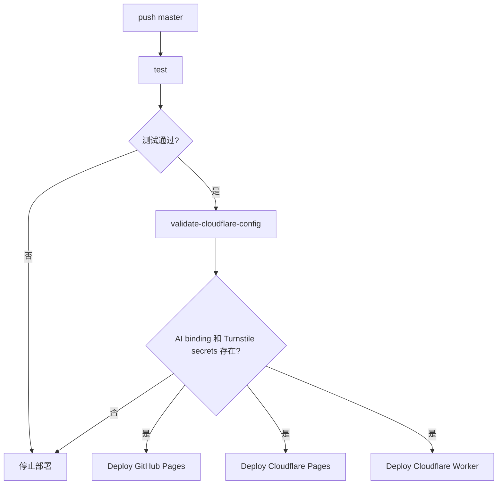
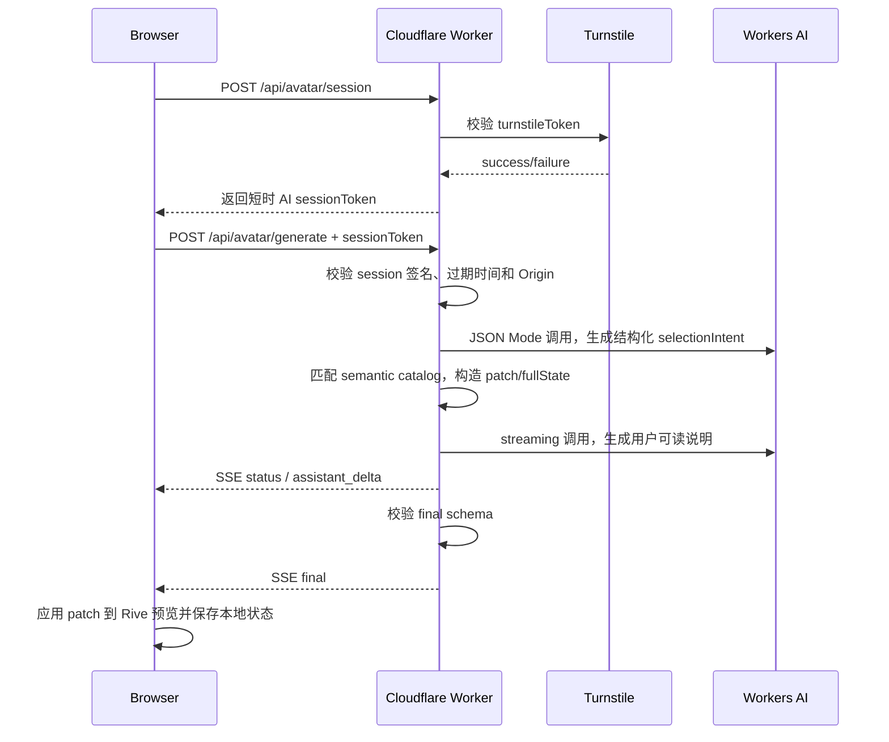

# Duolingo Avatar Creator 部署与 AI 生成实施文档

## 1. 当前架构

项目采用“双静态前端 + Cloudflare Worker API”的三端发布架构。

| 端 | 平台 | URL | 职责 |
| --- | --- | --- | --- |
| 前端 A | GitHub Pages | `https://wishflow.github.io/duolingo-avator-creator/` | 主公开入口 |
| 前端 B | Cloudflare Pages | `https://duolingo-avator-creator.pages.dev/` | 同一静态产物的 Cloudflare 镜像 |
| 后端 API | Cloudflare Worker | `https://duolingo-avator-creator.wei-shi-ws.workers.dev/` | 配置读取、Turnstile 校验、Workers AI 代理 |

一次 `push master` 的发布链路：



关键原则：

- 前端仍是静态站点，不保存任何 LLM key。
- AI 能力只通过 Cloudflare Worker 调用 Workers AI。
- Turnstile `secret key` 只存在 Worker secrets，不写入仓库。
- 缺少 AI binding 或 Turnstile secrets 时，阻断全部部署，避免上线不可用的 Generate 入口。

## 2. AI 生成功能

v1 不生成静态 AI 图片，而是生成“可编辑头像配置”。



Worker API：

| 路径 | 方法 | 行为 |
| --- | --- | --- |
| `/health` | `GET` | 服务健康检查 |
| `/api/config` | `GET` | 返回公开功能开关、Turnstile sitekey、prompt 长度等 |
| `/api/avatar/session` | `POST` | 使用 Turnstile token 换取短时 AI session |
| `/api/avatar/generate` | `POST` | 校验 AI session 后，SSE 返回最终头像配置和说明 |
| `OPTIONS *` | `OPTIONS` | CORS preflight |

`/api/avatar/session` 请求体：

| 字段 | 说明 |
| --- | --- |
| `turnstileToken` | 前端 Turnstile 校验得到的 token，仅用于换取短时 session |

`/api/avatar/session` 返回体：

| 字段 | 说明 |
| --- | --- |
| `sessionToken` | HMAC 签名的短时 AI session token |
| `expiresAt` | 过期时间，毫秒时间戳 |
| `ttlSeconds` | 默认 1800 秒，可通过 Worker env 调整 |

`/api/avatar/generate` 请求体：

| 字段 | 说明 |
| --- | --- |
| `prompt` | 用户描述，默认上限 800 字符 |
| `contextMode` | `default` 或 `current` |
| `baselineState` | 默认头像或当前头像的 state 快照 |
| `catalog` | 前端从 `avatar_builder_config.json` 生成的精简组件目录 |
| `sessionToken` | `/api/avatar/session` 返回的短时 token |

SSE 事件：

| event | data |
| --- | --- |
| `status` | 当前阶段文案 |
| `assistant_delta` | 根据生成过程输出的用户可读流式说明，替代旧 `plan_delta` |
| `final` | `{ ok, contextMode, model, patch, fullState, tutorialSteps, summary, warnings, confidence, usedFallback, selectionTrace }` |
| `error` | 生成失败原因 |

生成策略：

1. Worker 先使用 Workers AI JSON Mode 生成结构化 `selectionIntent`。
2. Worker 用 semantic catalog 匹配合法选项，生成相对 `baselineState` 的 `patch`。
3. Worker 构造 `fullState = baselineState + patch`，并生成结构化 `tutorialSteps`。
4. 若模型结构化输出失败、为空、或只有无变化值，Worker 使用确定性 fallback 映射，保证返回可编辑且可见的头像改动。
5. Worker 先发送 `status` 和可选 `assistant_delta`，最终只以已校验的 `final` 作为成功标准，且成功流最后发送 `final`。

默认模型：

```text
@cf/meta/llama-3.1-8b-instruct-fast
```

可通过 Worker env `AI_TEXT_MODEL` 覆盖。

## 3. 前端交互

### 3.1 Generate 页面

前端只新增同页路由，不新增独立 HTML：

```text
/#generate
```

入口：

| 场景 | 入口 |
| --- | --- |
| 桌面端 | 左侧工具栏顶部 `Generate` |
| 移动端 | 底部四按钮工具栏 `Generate / Export / Reset / More` |

Generate 页面包含：

- 当前头像小预览。
- prompt 输入框。
- `@` 弹窗，支持 `@current` 和 `@default`。
- 手动插入 `@current` / `@default` 的按钮。
- Turnstile 校验区域。
- `Verify` 按钮：必须显式点击后才会换取短时 AI session。
- `Generate editable avatar` 按钮：只有 AI session 有效且 prompt 非空时才可点击。
- 已应用编辑说明。
- 最终复刻步骤、warnings、confidence。

上下文规则：

| 输入 | 行为 |
| --- | --- |
| 无 mention | 从默认头像生成 |
| `@default` | 显式从默认头像生成 |
| `@current` | 基于当前头像修改 |

AI 返回结果后，前端直接应用到当前 Rive 预览；用户可以继续手动编辑，也可以导出 PNG。

### 3.2 Undo/Redo

本地持久历史覆盖所有头像改动：

- 手动选择 tile / 颜色。
- AI 生成结果。
- Reset。

保存策略：

| 项 | 是否保存 |
| --- | --- |
| 当前头像 state | 保存 |
| Undo past/future 栈 | 保存，最多 30 步 |
| prompt | 不保存 |
| AI 流式文字 | 不保存 |
| AI 生成结果文本 | 不保存 |

操作入口：

- 预览区左上角悬浮 Undo / Redo 图标。
- `Ctrl/Cmd + Z`
- `Ctrl/Cmd + Shift + Z`

当焦点在输入框或 textarea 内时，不拦截文本编辑快捷键。

## 4. Turnstile 与密钥配置

Turnstile widget 只允许公网双前端：

| Hostname |
| --- |
| `wishflow.github.io` |
| `duolingo-avator-creator.pages.dev` |

Worker secrets：

| Secret | 说明 |
| --- | --- |
| `TURNSTILE_SITE_KEY` | 前端可公开使用，但通过 `/api/config` 返回，避免静态站硬编码 |
| `TURNSTILE_SECRET_KEY` | Worker 调用 Turnstile `siteverify` 使用，必须保密 |
| `AI_SESSION_SECRET` | 可选，用于签名短时 AI session；未配置时复用 `TURNSTILE_SECRET_KEY` |

本地开发使用 `.env` 保存 Turnstile 配置，`.env` 不提交仓库，仓库只提交 `.env.example`：

```text
TURNSTILE_SITE_KEY=...
TURNSTILE_SECRET_KEY=...
AI_SESSION_SECRET=...
CLOUDFLARE_API_TOKEN=...
CLOUDFLARE_ACCOUNT_ID=...
```

写入 Worker secrets 时，从 `.env` 读取 `TURNSTILE_SITE_KEY` 和 `TURNSTILE_SECRET_KEY`；如需要独立 session 签名密钥，再写入 `AI_SESSION_SECRET`。不要把 secret key 写进源码、文档正文或静态前端。`CLOUDFLARE_API_TOKEN` 和 `CLOUDFLARE_ACCOUNT_ID` 只用于本地 Wrangler 操作或 GitHub Secrets。

## 5. GitHub Actions 门禁

workflow 包含四类 job：

| Job | 作用 |
| --- | --- |
| `test` | 安装 Chrome，运行 `npm run test:ci` |
| `validate-cloudflare-config` | 检查 Cloudflare API token、AI binding、Turnstile secrets |
| `deploy-github-pages` | 发布 GitHub Pages |
| `deploy-cloudflare-pages` | 发布 Cloudflare Pages |
| `deploy-cloudflare-worker` | 发布 Cloudflare Worker |

`validate-cloudflare-config` 执行：

```bash
npm run check:cloudflare-config
```

该脚本在本地会自动读取 `.env`；在 GitHub Actions 中使用 repository secrets。

检查内容：

- `CLOUDFLARE_API_TOKEN` 存在。
- `CLOUDFLARE_ACCOUNT_ID` 存在。
- `wrangler.toml` 包含 `[ai] binding = "AI"`。
- `wrangler secret list --format=json` 能看到：
  - `TURNSTILE_SITE_KEY`
  - `TURNSTILE_SECRET_KEY`

只检查 secret 名称，不读取 secret 值。

## 6. 本地命令

| 命令 | 用途 |
| --- | --- |
| `npm run build:site` | 构建 GitHub Pages / Cloudflare Pages 共用静态产物 |
| `npm run test:static` | 静态资源、HTML 引用、JS 语法检查 |
| `npm run test:worker` | Worker 单元测试，mock AI 与 Turnstile |
| `npm run test:e2e` | 本地有 Chrome 时跑浏览器 E2E；无 Chrome 时跳过 |
| `npm run test:ci` | CI 强制跑静态、Worker、浏览器 E2E |
| `npm run check:cloudflare-config` | 部署前 Cloudflare AI/secret 门禁 |
| `npm run deploy:cf:pages` | 部署 Cloudflare Pages |
| `npm run deploy:cf:worker` | 部署 Cloudflare Worker |

本地快速验证：

```bash
npm run test:static
npm run test:worker
npm run test:e2e
```

首次本地配置 Turnstile：

```bash
cp .env.example .env
# 填入 TURNSTILE_SITE_KEY 和 TURNSTILE_SECRET_KEY
```

本地 Worker 调试：

```bash
npx wrangler dev
```

然后访问：

```text
http://127.0.0.1:8787/health
http://127.0.0.1:8787/api/config
```

## 7. 部署验收

### GitHub Pages / Cloudflare Pages

| 检查项 | 预期 |
| --- | --- |
| 根路径 | 打开头像编辑器 |
| 静态资源 | `.riv`、JSON、manifest、icon、SVG 均为 200 |
| 移动端 | 预览固定在上方，底部四按钮可用 |
| Generate | 未配置时禁用并提示；配置后显示 Turnstile |
| Undo/Redo | 图标和快捷键可用 |
| Export | 当前头像可导出 PNG |

### Cloudflare Worker

| 请求 | 预期 |
| --- | --- |
| `GET /health` | 200，`ok: true` |
| `GET /api/config` | 200，包含 `features.avatarGeneration` 和 `generation.turnstileSiteKey` |
| `POST /api/avatar/generate` 无 token | 400/403，不调用 AI |
| `POST /api/avatar/generate` 有效 token | SSE 返回 `status` / `assistant_delta`，并以包含 `patch/fullState/tutorialSteps` 的 `final` 结束 |
| 未授权 Origin | 不返回 `Access-Control-Allow-Origin` |

CI 不会真调用 generate，避免消耗 Workers AI 额度，也避免自动化绕过 Turnstile。

## 8. 后续路线

| 阶段 | 内容 |
| --- | --- |
| 组件语义 catalog | 为发型、衣服、帽子等补人工/半自动语义标签，提高匹配准确度 |
| Vision 增强 | 可选接入视觉模型，让模型分析生成图或用户上传图 |
| 图片输入 | 支持用户上传参考图，经 Worker 做安全校验后再调用模型 |
| 账号与历史 | 引入登录、云端历史、配额控制和用户数据删除能力 |
| 计费控制 | 增加更严格的速率限制、用量日志和管理员开关 |
