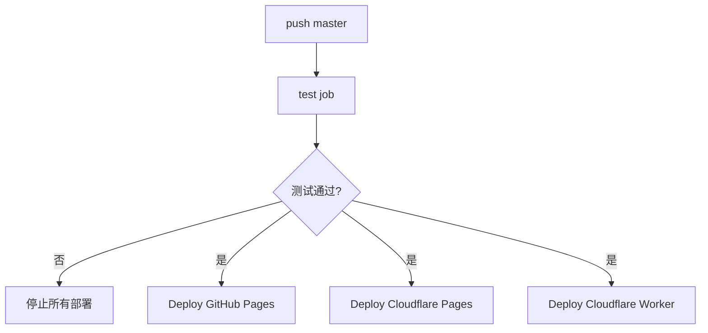
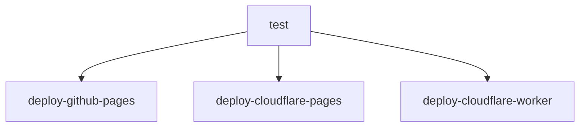
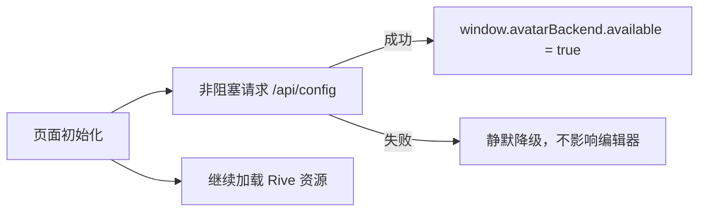
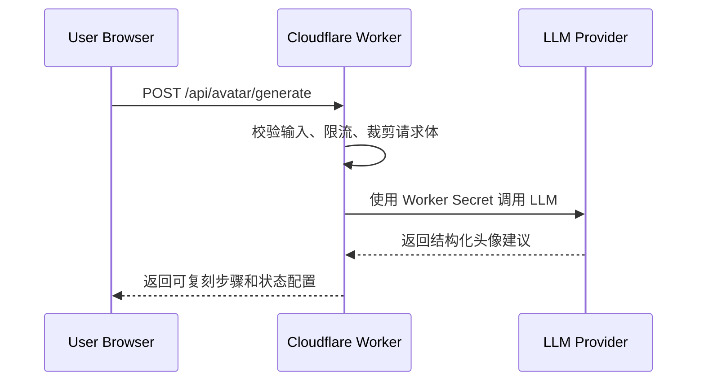

# Duolingo Avatar Creator 双前端 + Worker API 部署计划

## 1. 目标与结论

本项目采用“三端发布”架构：

| 端 | 平台 | URL | 职责 |
| --- | --- | --- | --- |
| 前端 A | GitHub Pages | `https://wishflow.github.io/duolingo-avator-creator/` | 当前主入口，继续作为稳定公开访问地址 |
| 前端 B | Cloudflare Pages | `https://duolingo-avator-creator.pages.dev/` | 同一份静态产物的 Cloudflare 镜像 |
| 后端 API | Cloudflare Worker | `https://duolingo-avator-creator.wei-shi-ws.workers.dev/` | API 骨架，未来承载 LLM/工具调用代理 |

一次 `push` 到 `master` 后，GitHub Actions 负责：



核心原则：

- 前端仍是静态站点，可在 GitHub Pages 和 Cloudflare Pages 双部署。
- 后端只放在 Cloudflare Worker，未来的 LLM API key 只放 Worker secret。
- GitHub Actions 是唯一自动发布入口，不启用 Cloudflare Pages 的 Git 自动构建，避免双重部署来源。
- 测试失败时不部署，保证线上版本来自已验证产物。

## 2. 当前状态

| 项 | 当前状态 | 说明 |
| --- | --- | --- |
| GitHub Pages | 已可用 | 现有 workflow 会把 `assets/` 打包为 `_site/` 并发布 |
| Cloudflare Pages project | 已创建 | project 名称：`duolingo-avator-creator`；首次静态部署需要 GitHub Actions secrets |
| Cloudflare Worker script | 已存在 | script 名称：`duolingo-avator-creator` |
| Worker `workers.dev` | 已开启 | URL 使用账户子域名 `wei-shi-ws` |
| Worker API | 已通过 Cloudflare API 验证 | CI 后续会用仓库代码继续发布，不接真实 LLM |
| GitHub Actions secrets | 需要配置 | CI 部署 Cloudflare 必须有 `CLOUDFLARE_API_TOKEN`、`CLOUDFLARE_ACCOUNT_ID` |

Cloudflare 访问地址规则：

```text
Cloudflare Pages:
https://duolingo-avator-creator.pages.dev/

Cloudflare Worker:
https://duolingo-avator-creator.wei-shi-ws.workers.dev/
```

> 注意：Worker URL 不是 `https://duolingo-avator-creator.workers.dev/`，而是 `https://<script-name>.<account-subdomain>.workers.dev/`。

## 3. 分阶段实施步骤

### 阶段 1：保持 GitHub Pages 稳定

目标：不破坏当前公网前端。

实施内容：

- 保留现有 GitHub Pages 发布逻辑。
- 继续使用 `_site/` 作为静态发布目录。
- 继续把 `assets/avatar_explorer.html` 复制为 `_site/index.html`。
- 保持测试门禁：`test` job 通过后才进入部署。

验收：

```bash
npm run test:static
npm run test:e2e
```

线上验收：

```text
https://wishflow.github.io/duolingo-avator-creator/
```

### 阶段 2：新增 Cloudflare Worker API 骨架

目标：先建立安全后端边界，不接真实 LLM。

Worker 名称：

```text
duolingo-avator-creator
```

Worker API v1：

| 路径 | 方法 | 状态码 | 行为 |
| --- | --- | --- | --- |
| `/health` | `GET` | 200 | 返回服务健康状态 |
| `/api/config` | `GET` | 200 | 返回公开 API 配置和功能开关 |
| `/api/avatar/generate` | `POST` | 501 | 明确返回未实现，预留未来 LLM 入口 |
| 任意路径 | `OPTIONS` | 204 | 返回 CORS preflight |
| 未知路径 | 任意 | 404 | 返回 JSON 错误 |

示例响应：

```json
{
  "ok": true,
  "service": "duolingo-avator-creator",
  "version": "0.1.0"
}
```

CORS 允许来源：

| 来源 | 用途 |
| --- | --- |
| `https://wishflow.github.io` | GitHub Pages 前端 |
| `https://duolingo-avator-creator.pages.dev` | Cloudflare Pages 前端 |
| `http://127.0.0.1:*` | 本地测试 |
| `http://localhost:*` | 本地开发 |

安全边界：

- 当前 Worker 不保存用户图片。
- 当前 Worker 不接 LLM provider。
- 当前 Worker 不需要数据库。
- 未来 LLM API key 只通过 `wrangler secret put ...` 或 Cloudflare dashboard 配置，不写入仓库。

### 阶段 3：新增 Cloudflare Pages 前端镜像

目标：Cloudflare Pages 发布与 GitHub Pages 完全一致的静态产物。

产物生成方式：

```bash
npm run build:site
```

产物结构：

```text
_site/
  index.html                         # 来自 assets/avatar_explorer.html
  avatar_builder_config.json
  avatar_builder_25_sept2025.riv
  manifest.webmanifest
  avatar-icon-192.png
  avatar-icon-512.png
  *.svg
  .nojekyll
```

Cloudflare Pages 发布命令：

```bash
npm run deploy:cf:pages
```

等价 Wrangler 命令：

```bash
wrangler pages deploy _site --project-name=duolingo-avator-creator --branch=master
```

验收：

```text
https://duolingo-avator-creator.pages.dev/
```

并确认这些资源返回 200：

```text
/manifest.webmanifest
/avatar-icon-192.png
/avatar_builder_config.json
/avatar_builder_25_sept2025.riv
```

### 阶段 4：GitHub Actions 三端部署

目标：同一条流水线发布三端。

流水线结构：



必需 GitHub repository secrets：

| Secret | 用途 |
| --- | --- |
| `CLOUDFLARE_API_TOKEN` | Wrangler 部署 Pages/Worker |
| `CLOUDFLARE_ACCOUNT_ID` | 指定 Cloudflare account |

`CLOUDFLARE_API_TOKEN` 最小建议权限：

| 权限 | 级别 |
| --- | --- |
| Account / Cloudflare Pages / Edit | Account |
| Account / Workers Scripts / Edit | Account |
| Account / Account Settings / Read | Account |

如果需要后续由 CI 写入 secret，再额外授权 Worker secret 相关权限；当前阶段不需要。

### 阶段 5：前端接入 Worker 基础配置

目标：前端知道 Worker API base URL，但不依赖后端才能启动。

当前默认 API base：

```text
https://duolingo-avator-creator.wei-shi-ws.workers.dev
```

前端加载策略：



关键约束：

- API 不可用时，头像编辑器仍能编辑和导出 PNG。
- 不在前端保存任何 LLM key。
- 未来接入生成头像功能时，前端只调用 Worker；Worker 再调用 LLM provider。

## 4. 本地命令

| 命令 | 用途 |
| --- | --- |
| `npm run build:site` | 生成 GitHub Pages / Cloudflare Pages 共用静态产物 |
| `npm run test:static` | 静态资源、HTML 引用、JS 语法检查 |
| `npm run test:worker` | Worker API 单元测试 |
| `npm run test:e2e` | 本地有 Chrome 时跑浏览器 E2E；无 Chrome 时跳过 |
| `npm run test:ci` | CI 强制跑静态、Worker、浏览器 E2E |
| `npm run deploy:cf:pages` | 部署 Cloudflare Pages |
| `npm run deploy:cf:worker` | 部署 Cloudflare Worker |

本地完整静态验证：

```bash
npm run test:static
npm run test:worker
npm run build:site
```

本地 Worker 验证：

```bash
npx wrangler dev
```

然后访问：

```text
http://127.0.0.1:8787/health
http://127.0.0.1:8787/api/config
```

## 5. 部署验收清单

### GitHub Pages

| 检查项 | 预期 |
| --- | --- |
| 根路径 | 打开头像编辑器 |
| `manifest.webmanifest` | 200 |
| `avatar-icon-192.png` | 200 |
| `.riv` 文件 | 200 |
| 编辑/导出 | 可选择头像元素并导出 PNG |

### Cloudflare Pages

| 检查项 | 预期 |
| --- | --- |
| 根路径 | 打开同一头像编辑器 |
| 静态资源 | 与 GitHub Pages 同样返回 200 |
| 移动端布局 | 固定预览、底部全局操作栏 |
| 浏览器控制台 | 无静态资源 404 |

### Cloudflare Worker

| 请求 | 预期 |
| --- | --- |
| `GET /health` | 200，`ok: true` |
| `GET /api/config` | 200，包含 `apiVersion` 和 `features` |
| `POST /api/avatar/generate` | 501，`error: not_implemented` |
| GitHub Pages Origin | 返回 `Access-Control-Allow-Origin` |
| Cloudflare Pages Origin | 返回 `Access-Control-Allow-Origin` |
| 未授权 Origin | 不返回 `Access-Control-Allow-Origin` |

## 6. 未来接入 LLM 的部署边界

未来目标是：用户上传图片或输入文字后，由后端调用 LLM/API/图像工具生成可复刻的 Duolingo 风格头像说明。

推荐演进：



必须坚持：

- LLM key 不进入 GitHub Pages 或 Cloudflare Pages。
- Worker 对请求体大小、MIME、频率做限制后再转发。
- 生成结果使用结构化 JSON，前端再转换为头像编辑器状态或步骤说明。
- 若需要保存用户历史，再单独引入账号体系和数据库；当前阶段不保存。
