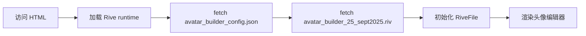
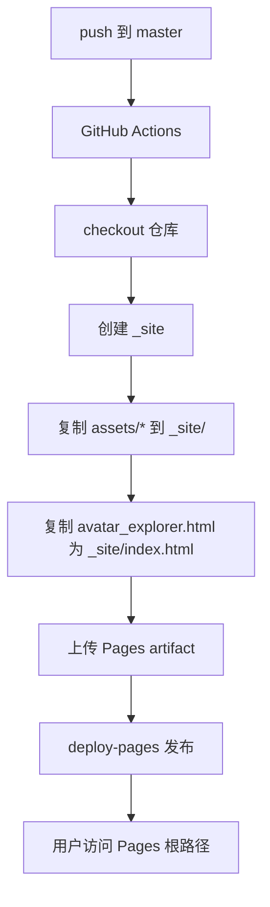
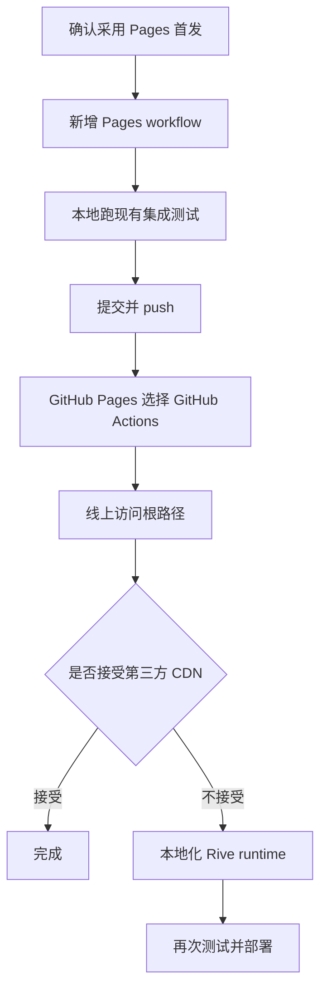

# Duolingo Avatar Creator 部署方案评估

## 1. 结论

当前项目可以按纯前端静态站点部署，不需要先容器化。

首选方案是 **GitHub Pages + GitHub Actions 自定义工作流**：把 `assets/` 目录打包成 Pages artifact，并在部署产物根目录生成 `index.html`，这样最终可以通过项目 Pages 根路径直接访问：

```text
https://wishflow.github.io/duolingo-avator-creator/
```

容器方案也可行，但更适合需要自有服务器、内网部署、自定义 HTTP 缓存/安全头、统一容器发布链路的场景。对当前项目来说，容器不是最小方案。

## 2. 项目现状

| 维度 | 现状 | 部署影响 |
| --- | --- | --- |
| 前端入口 | `assets/avatar_explorer.html` | 不是 `index.html`，直接部署根目录时需要重命名或生成入口 |
| 构建系统 | `package.json` 无 `scripts`，无 Vite/Webpack 构建流程 | 可以直接静态部署，无需 Node 构建 |
| 运行时资源 | 页面通过相对路径加载 `avatar_builder_config.json`、`.riv`、SVG | 只要保持这些文件与 HTML 的相对路径即可 |
| Rive runtime | HTML 里引用 `https://unpkg.com/@rive-app/canvas@2.37.8/rive.js` | Pages 可用，但依赖第三方 CDN；可选本地化 |
| 静态资源大小 | `assets/` 约 3.1 MB，仓库约 6.5 MB | 远低于 GitHub Pages 站点 1 GB 限制 |
| 本地访问要求 | README 说明需要 HTTP 服务，不能直接 `file://` | GitHub Pages/容器都满足 HTTP 访问 |
| 自动化测试 | `tests/test_avatar_explorer.py` 启动本地 HTTP + headless Chrome | 部署前可继续用现有测试做回归 |

当前 HTML 初始化逻辑如下：



## 3. 外部约束

GitHub Pages 官方文档确认：

- GitHub Pages 用于托管静态 HTML/CSS/JavaScript，也可以通过 Actions 执行构建后发布。
- 分支发布源只能选择仓库根目录 `/` 或 `/docs`。
- 如果使用 Actions 发布，部署 artifact 顶层需要有入口文件，例如 `index.html`。
- GitHub Pages 不支持服务端语言，例如 PHP、Ruby、Python。
- Pages 公开站点有容量、构建时长、带宽等软限制；当前项目体积很小，不构成问题。

另外，本项目是 Duolingo 头像编辑器的反向研究/复刻项目。公开部署前建议在页面或 README 中增加明显声明：本项目非 Duolingo 官方项目，仅用于学习/研究，不收集用户数据。

## 4. 可行方案对比

| 方案 | 访问路径 | 改动量 | 优点 | 缺点 | 适用判断 |
| --- | --- | --- | --- | --- | --- |
| A. GitHub Pages + Actions 打包 `assets/` | `/duolingo-avator-creator/` | 小 | 根路径可直接访问；不污染源码目录；不需要构建框架 | 需要新增 GitHub Actions workflow；默认仍依赖 unpkg | 推荐首选 |
| B. GitHub Pages 从 `master` 根目录发布 | `/duolingo-avator-creator/assets/avatar_explorer.html` | 极小 | 几乎不用改代码 | 根路径会优先看到 README/非应用入口；路径不够友好 | 只适合临时预览 |
| C. GitHub Pages + Actions + 本地化 Rive runtime | `/duolingo-avator-creator/` | 中 | 不依赖 unpkg/jsDelivr；可控性更高 | 需要复制 `rive.js`、`rive.wasm`、`rive_fallback.wasm` 并调整 runtime URL | 推荐作为第二阶段增强 |
| D. Nginx 静态容器 | 自定义域名或服务器地址 | 中 | 部署到任意容器平台；可配置缓存、安全头、访问控制 | 需要容器宿主或平台；对纯静态公开访问偏重 | 有现成容器平台时使用 |
| E. 第三方静态托管（Cloudflare Pages/Netlify 等） | 平台分配或自定义域名 | 小到中 | 静态托管能力强；配置灵活 | 引入额外平台账号和配置 | 如果不想用 GitHub Pages 可考虑 |

## 5. 推荐方案：GitHub Pages + Actions

### 5.1 目标

把仓库里的 `assets/` 作为静态站点根目录发布，并在发布产物中把 `avatar_explorer.html` 复制为 `index.html`。



### 5.2 计划改动

新增：

```text
.github/workflows/pages.yml
```

工作流核心逻辑：

```yaml
name: Deploy static site to GitHub Pages

on:
  push:
    branches: [master]
  workflow_dispatch:

permissions:
  contents: read
  pages: write
  id-token: write

concurrency:
  group: pages
  cancel-in-progress: false

jobs:
  deploy:
    runs-on: ubuntu-latest
    environment:
      name: github-pages
      url: ${{ steps.deployment.outputs.page_url }}
    steps:
      - uses: actions/checkout@v6

      - uses: actions/configure-pages@v5

      - name: Prepare static site
        run: |
          mkdir -p _site
          cp -R assets/* _site/
          cp assets/avatar_explorer.html _site/index.html
          touch _site/.nojekyll

      - uses: actions/upload-pages-artifact@v4
        with:
          path: _site

      - id: deployment
        uses: actions/deploy-pages@v4
```

GitHub 仓库设置：

1. 打开仓库 `Settings`。
2. 进入 `Pages`。
3. `Build and deployment` 的 `Source` 选择 `GitHub Actions`。
4. push 后在 `Actions` 查看部署结果。

### 5.3 为什么不直接用分支根目录发布

如果直接设置 `master` + `/`：

```text
https://wishflow.github.io/duolingo-avator-creator/
```

会以仓库根目录为站点根。当前根目录没有应用入口 `index.html`，但有 `README.md`，因此根路径不一定会进入头像编辑器。真实应用路径会变成：

```text
https://wishflow.github.io/duolingo-avator-creator/assets/avatar_explorer.html
```

这能访问，但不符合“直接访问”的目标。

### 5.4 验证方式

部署前本地验证：

```bash
python3 tests/test_avatar_explorer.py --port 8775 --debug-port 9228
```

部署后线上验证：

| 检查项 | 预期 |
| --- | --- |
| 根路径访问 | `https://wishflow.github.io/duolingo-avator-creator/` 打开头像编辑器 |
| 静态资源 | `avatar_builder_config.json`、`.riv`、SVG 全部 200 |
| Rive runtime | `rive.js`、`rive.wasm` 正常加载 |
| 页面功能 | 默认头像渲染、切换 tab、选择 tile、导出 PNG |
| 浏览器控制台 | 无 404、CORS、WASM 初始化失败 |

## 6. 第二阶段增强：本地化 Rive runtime

当前页面依赖：

```html
<script src="https://unpkg.com/@rive-app/canvas@2.37.8/rive.js"></script>
```

本地 `node_modules/@rive-app/canvas/` 已包含：

```text
rive.js
rive.wasm
rive_fallback.wasm
```

如果要消除第三方 CDN 依赖，可以改为：

```text
assets/vendor/rive/rive.js
assets/vendor/rive/rive.wasm
assets/vendor/rive/rive_fallback.wasm
```

并在页面中使用本地脚本和 WASM 地址：

```html
<script src="vendor/rive/rive.js"></script>
<script>
window.rive.RuntimeLoader.setWasmUrl('vendor/rive/rive.wasm');
window.rive.RuntimeLoader.setWasmFallbackUrl('vendor/rive/rive_fallback.wasm');
</script>
```

收益：

- 页面不依赖 unpkg/jsDelivr 可用性。
- 版本完全由仓库锁定。
- GitHub Pages、容器、离线内网部署表现一致。

代价：

- 仓库增加约 4.1 MB 静态文件。
- 后续升级 `@rive-app/canvas` 时需要同步更新 vendored 文件。

## 7. 容器方案

如果后续需要部署到自有服务器、Kubernetes、Render/Fly.io/Railway 等容器平台，可以新增 Nginx 静态镜像。

### 7.1 Dockerfile 草案

```dockerfile
FROM nginx:1.27-alpine

COPY assets/ /usr/share/nginx/html/
COPY assets/avatar_explorer.html /usr/share/nginx/html/index.html
```

本地运行：

```bash
docker build -t duolingo-avatar-creator .
docker run --rm -p 8080:80 duolingo-avatar-creator
```

访问：

```text
http://127.0.0.1:8080/
```

### 7.2 GHCR 发布草案

如果要把镜像发布到 GitHub Container Registry，可新增：

```text
.github/workflows/container.yml
```

核心要点：

- `permissions.packages: write`
- 使用 `docker/login-action` 登录 `ghcr.io`
- 使用 `docker/metadata-action` 生成标签
- 使用 `docker/build-push-action` 构建并推送镜像

### 7.3 容器方案取舍

| 问题 | 判断 |
| --- | --- |
| 当前是否需要服务端逻辑 | 不需要 |
| 当前是否需要私有访问控制 | 未体现 |
| 当前是否需要自定义响应头 | 未体现 |
| 当前是否有容器平台承载 | 未体现 |
| 当前是否值得引入镜像构建和运行维护 | 暂不值得 |

所以容器方案建议作为后备，不作为首发。

## 8. 推荐执行顺序



建议先做 A 方案：

1. 新增 `.github/workflows/pages.yml`。
2. 不改前端逻辑，只改变部署产物入口。
3. 部署成功后用线上 URL 验证。
4. 如果希望完全自包含，再做 C 方案本地化 Rive runtime。

## 9. 风险与回滚

| 风险 | 影响 | 处理 |
| --- | --- | --- |
| Pages 未启用 GitHub Actions source | workflow 跑了但不发布 | 在仓库 `Settings > Pages` 切换 Source |
| 根路径 404 | artifact 顶层没有 `index.html` | 检查 `_site/index.html` 生成步骤 |
| `.riv` 或 JSON 404 | 相对路径被破坏 | 确保 `assets/*` 被复制到 `_site/` 根部 |
| Rive CDN 不可用 | 页面无法初始化 | 做第二阶段本地化 runtime |
| GitHub Pages 合规/版权风险 | 公开站点可能被投诉或下线 | 增加明显非官方声明，避免收集数据 |
| Actions 失败 | 无法自动部署 | 查看 Actions 日志，必要时先用 B 方案临时访问 |

回滚方式：

1. 禁用或删除 Pages workflow。
2. 在 `Settings > Pages` 关闭 Pages 或改回分支发布。
3. revert 对应部署提交。

## 10. 参考资料

- GitHub Pages 发布源配置：<https://docs.github.com/en/pages/getting-started-with-github-pages/configuring-a-publishing-source-for-your-github-pages-site>
- GitHub Pages 自定义 workflow：<https://docs.github.com/en/pages/getting-started-with-github-pages/using-custom-workflows-with-github-pages>
- GitHub Pages 限制：<https://docs.github.com/en/pages/getting-started-with-github-pages/github-pages-limits>
- 创建 GitHub Pages 站点：<https://docs.github.com/en/pages/getting-started-with-github-pages/creating-a-github-pages-site>
- GitHub Actions 发布 Docker 镜像：<https://docs.github.com/en/actions/tutorials/publish-packages/publish-docker-images>
- GitHub Container Registry：<https://docs.github.com/en/packages/working-with-a-github-packages-registry/working-with-the-container-registry>
