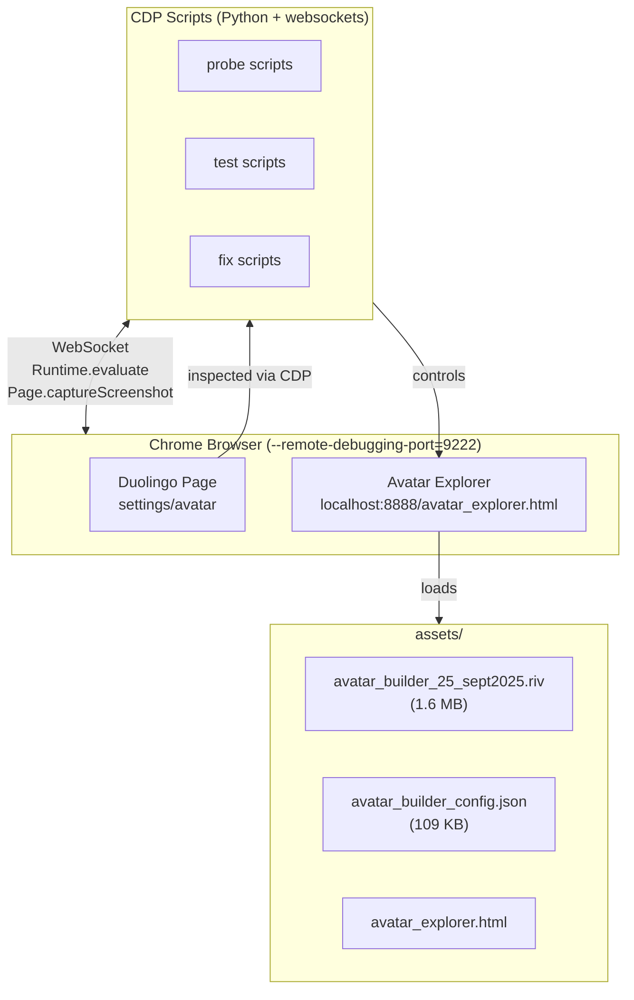
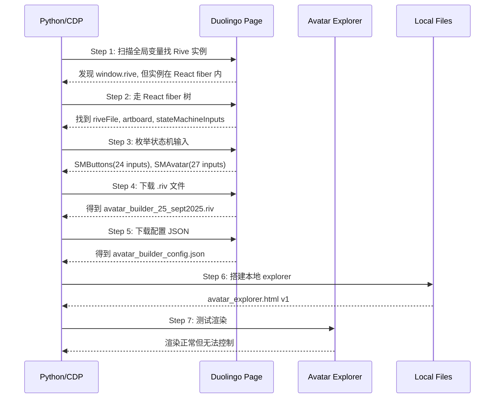
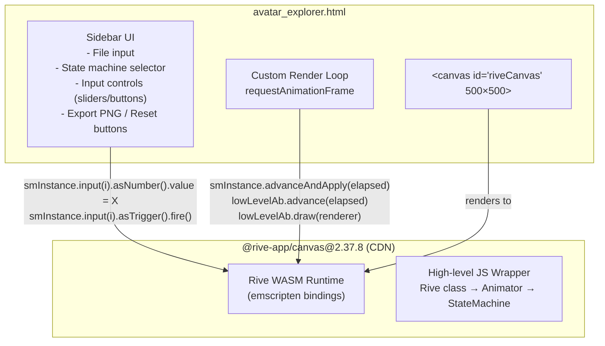

# Duolingo Rive Avatar 逆向分析文档

> 目标：从 Duolingo 网页版头像编辑器中提取所有卡通头像元素（眉毛、眼睛、嘴巴、发型、眼镜、胡须、头饰等），方便后续自由组合生成各种头像。

---

## 目录

1. [项目架构总览](#1-项目架构总览)
2. [数据获取方式](#2-数据获取方式)
3. [Rive 文件格式分析](#3-rive-文件格式分析)
4. [Avatar Explorer 编辑器设计](#4-avatar-explorer-编辑器设计)
5. [Rive API 双层架构](#5-rive-api-双层架构)
6. [关键发现与突破](#6-关键发现与突破)
7. [遇到的问题与状态](#7-遇到的问题与状态)
8. [文件清单](#8-文件清单)

---

## 1. 项目架构总览



**工作流程**：
1. Chrome 以 `--remote-debugging-port=9222` 启动
2. Python 脚本通过 Chrome DevTools Protocol (CDP) WebSocket 连接
3. 在 Duolingo 页面注入 JS 探索 Rive 实例结构
4. 在本地 explorer 页面测试渲染和控制方案
5. 所有静态资源放在 `assets/` 目录

---

## 2. 数据获取方式

### 2.1 Rive 文件来源

| 资源 | 大小 | 获取方式 |
|------|------|----------|
| `avatar_builder_25_sept2025.riv` | 1.6 MB | 从 Duolingo 页面网络请求中截获，Chrome DevTools Network 面板导出 |
| `avatar_builder_config.json` | 109 KB | 同上，包含头像编辑器 UI 配置和默认值 |

### 2.2 CDP 通信协议

```
┌─────────────┐     WebSocket      ┌──────────────────┐
│  Python      │◄──────────────────►│  Chrome DevTools  │
│  (client)    │   JSON messages    │  (server)         │
└─────────────┘                    └──────────────────┘
```

核心 API 调用模式：

```
1. Runtime.enable          → 启用 JS 执行能力
2. Runtime.evaluate({      → 在页面上下文中执行 JS
     expression: "...",
     returnByValue: true
   })
3. Page.captureScreenshot  → 截取页面截图
4. Page.reload             → 刷新页面
```

**示例 — 在页面注入 JS 并获取返回值**：
```python
async def recv(ws, eid, timeout=15):
    while True:
        raw = await asyncio.wait_for(ws.recv(), timeout=timeout)
        msg = json.loads(raw)
        if msg.get("id") == eid:
            return msg

# 发送指令
await ws.send(json.dumps({
    "id": 10,
    "method": "Runtime.evaluate",
    "params": {
        "expression": "(function() { return document.title; })()",
        "returnByValue": True
    }
}))
# 接收结果
resp = await recv(ws, 10)
value = resp["result"]["result"]["value"]
```

### 2.3 探索过程时间线



---

## 3. Rive 文件格式分析

### 3.1 Rive 文件内部结构

```
avatar_builder_25_sept2025.riv
└── File
    └── Artboard: "MainAvatar" (1000×250)
        ├── 371 Animations (artboard timeline)
        ├── 2 State Machines
        │   ├── SMButtons (24 inputs)
        │   └── SMAvatar (27 inputs)
        └── Nodes (shapes, bones, paths, etc.)
```

### 3.2 动画命名规则

371 个动画按功能分类，命名规则为 `{CATEGORY}_{INDEX}_{OPTION}`：

| 前缀 | 含义 | 数量 | 示例 |
|------|------|------|------|
| `BGC_##` | Background Color 背景色 | ~25 | `BGC_22_FF4B4B`, `BGC_Duocon`, `BGC_00_ZeroState` |
| `ST_##` | Skin Tone 肤色 | 16 | `ST_00_E18E70` ~ `ST_15_6E3D3A` |
| `MH_##` | Main Hair 发型 | 73 | `MH_00_ZeroState` ~ `MH_73` |
| `MHC_##` | Main Hair Color 发色 | 17 | `MHC_00_ZeroState` ~ `MHC_16_249472` |
| `E_*` | Expression 表情 | ~40+ | `E_Normal_01_A_Standard`, `E_Silly_03_A_Standard` |
| `EC_*` | Eye Color 眼睛颜色 | ~15 | `EC_ZeroState`, `EC_3D3D3D`, `EC_Super` |
| `CC_##` | Clothing Color 服装颜色 | 11 | `CC_00_ZeroState` ~ `CC_10_777777` |
| `FHC_##` | Facial Hair Color 胡须颜色 | 17 | `FHC_00_ZeroState` ~ `FHC_16_167856` |
| `FHCMouth_##` | Facial Hair Mouth Color | ~16 | 同上映射 |
| `B_##` | Body 体型 | 6 | `B_00_ZeroState` ~ `B_06` |
| `HW_##` | Headwear 头饰 | 13 | `HW_00_none` ~ `HW_12` |
| `HWC_##` | Headwear Color 头饰颜色 | 10 | `HWC_00_ZeroState` ~ `HWC_09_575757` |
| `GC_##` | Glasses Color 眼镜颜色 | 9 | `GC_00_ZeroState` ~ `GC_08_black` |
| `NP_##` | Nose Piercing 鼻环 | 4 | `NP_00_None`, `NP_01_Stud_FFC700` |
| `PE_##` | Piercings 穿孔 | 7 | `PE_00_None` ~ `PE_06_Hoops_C8D1DC` |
| `Head_#` | Head Shape 头型 | 7 | `Head_1` ~ `Head_6` |
| `Zoom_##` | Zoom Level 缩放 | ~4 | `Zoom_00_ButtonHead`, `Zoom_01_Avatar` |
| `HeadFlipped` | 头部翻转 | 2 | `HeadFlipped_00_OFF`, `HeadFlipped_01_ON` |
| `XPBoost` | XP 增益特效 | 2 | `XPBoost_00_OFF`, `XPBoost_01_ON` |
| `DefaultAvatar_##` | 预设头像配置 | 5 | `DefaultAvatar_00_CE82FF` ~ `DefaultAvatar_04_58A700` |
| `Animation_Idle` | 待机动画 | 2 | `Animation_Idle_STANDARD`, `Animation_Idle_TRANSITION` |

### 3.3 两个状态机的输入对比

```
SMButtons  (24 inputs)              SMAvatar (27 inputs)
─────────────────────────          ─────────────────────────
 0: Headshape                       0: default_avatar_bool  ← 新增
 1: HeadphonesColour                1: default_avatar_num   ← 新增
 2: Headphones                      2: bounce_trig          ← 新增
 3: ENG_ONLY_HeadFlip       →       3: Headshape
 4: ENG_ONLY_Zoom           →       4: HeadphonesColour
 5: ENG_ONLY_Animation      →       5: Headphones
 6: ENG_ONLY_XPBoost        →       6: ENG_ONLY_HeadFlip
 7: SkinTone                 →       7: ENG_ONLY_Zoom
 8: Body                     →       8: ENG_ONLY_Animation
 9: MainHairColor            →       9: ENG_ONLY_XPBoost
10: MainHair                 →      10: SkinTone
11: EyeColor                 →      11: Body
12: Expression               →      12: MainHairColor
13: GlassesColor             →      13: MainHair
14: Glasses                  →      14: EyeColor
15: Wrinkles                 →      15: Expression
16: Piercings                →      16: GlassesColor
17: Nose Piercing            →      17: Glasses
18: FacialHairColor          →      18: Wrinkles
19: FacialHair               →      19: Piercings
20: HeadwearColor            →      20: Nose Piercing
21: Headwear                 →      21: FacialHairColor
22: ClothingColor            →      22: FacialHair
23: BackgroundColor          →      23: HeadwearColor
                                →  24: Headwear
                                →  25: ClothingColor
                                →  26: BackgroundColor
```

### 3.4 输入类型枚举

| Type 值 | 含义 | JS 获取方式 | 设值方式 |
|---------|------|------------|---------|
| 56 | Number | `input.value` | `input.asNumber().value = N` |
| 58 | Trigger | `input.value` | `input.asTrigger().fire()` |
| 59 | Boolean | `input.value` | `input.asBool().value = true/false` |

---

## 4. Avatar Explorer 编辑器设计

### 4.1 架构图



### 4.2 自定义渲染循环

由于 `@rive-app/canvas` 高层 API 存在 bug（见第 5 节），编辑器**绕过**高层 Animator，使用自定义渲染循环：

```javascript
// 全局状态
let riveInst = null;      // new Rive({canvas, buffer, autoplay: false})
let lowLevelFile = null;  // riveInst.riveFile.file (WASM File 对象)
let lowLevelAb = null;    // file.defaultArtboard() (WASM Artboard 对象)
let smInstance = null;    // new StateMachineInstance(sm, artboard)
let rafId = null;

// 自定义渲染循环
function renderLoop(timestamp) {
  rafId = requestAnimationFrame(renderLoop);
  if (!smInstance || !lowLevelAb || !riveInst) return;

  if (lastTime === 0) { lastTime = timestamp; return; }
  let elapsed = (timestamp - lastTime) / 1000;
  if (elapsed <= 0) elapsed = 0.016;
  if (elapsed > 0.1) elapsed = 0.1;  // 防止跳帧
  lastTime = timestamp;

  try {
    smInstance.advanceAndApply(elapsed);  // 1. 推进状态机
    lowLevelAb.advance(elapsed);          // 2. 推进画板动画
    lowLevelAb.draw(riveInst.renderer);   // 3. 绘制
  } catch(e) {}
}
```

### 4.3 状态机切换与输入控制

```
selectStateMachine(index)
│
├── lowLevelAb.stateMachineByIndex(index)  → 获取状态机定义
├── new StateMachineInstance(sm, ab)        → 创建实例
├── smInstance.inputCount()                 → 获取输入数量
│
└── buildInputControls()
    │
    ├── smInstance.input(i)                 → 获取每个输入
    ├── inp.name                            → 判断分类
    ├── inp.type                            → 判断控件类型
    │   ├── 56 (Number)  → <input type="range">
    │   ├── 59 (Bool)    → <input type="checkbox">
    │   └── 58 (Trigger) → <button onclick="...">
    │
    └── 按类别分组 (外观/毛发/配饰/穿孔/服装/背景/其他/Engine/默认)
```

### 4.4 UI 分类映射

```
input.name  →  category
──────────────────────────
SkinTone, Body, Expression, Wrinkles, EyeColor         → 外观
MainHair, MainHairColor, FacialHair, FacialHairColor   → 毛发
Headwear, HeadwearColor, Glasses, GlassesColor         → 配饰
Piercings, Nose Piercing                               → 穿孔
ClothingColor                                          → 服装
BackgroundColor                                        → 背景
Headshape, Headphones, HeadphonesColour                → 其他
ENG_ONLY_*                                             → Engine
default_avatar_*                                       → 默认
```

---

## 5. Rive API 双层架构

### 5.1 层级关系

```
┌─────────────────────────────────────────────┐
│         High-level JS API                    │
│  riveInst.play() / stateMachineInputs()     │
│  StateMachine / StateMachineInput           │
│  ⚠️  BUG: advance() 调用错误               │
├─────────────────────────────────────────────┤
│         Low-level WASM API                   │
│  runtime.StateMachineInstance               │
│  artboard.advance() / draw()                │
│  SMIInput / asNumber() / asTrigger()        │
│  LinearAnimation / LinearAnimationInstance   │
├─────────────────────────────────────────────┤
│         WASM Runtime (emscripten)            │
│  C++ Rive runtime compiled to WASM          │
└─────────────────────────────────────────────┘
```

### 5.2 高层 API 的已知 Bug

在 `@rive-app/canvas@2.37.8` 源码中（`/tmp/package/rive.js`）：

```javascript
// Line ~5050 — BUG
StateMachine.prototype.advance = function(elapsedTime) {
    // ❌ this.stateMachine 是状态机定义对象，不是实例
    //   stateMachine 定义没有 advanceAndApply 方法
    this.stateMachine.advanceAndApply(elapsedTime);  // → undefined error

    // ✅ 正确的应该是:
    // this.instance.advanceAndApply(elapsedTime);
};
```

**影响**：高层 API 的 `Animator` 在渲染循环中调用 `sm.advance(elapsed)`，每次都抛异常，导致状态机输入变化**永远不会**反映到渲染结果中。

### 5.3 输入设值的正确方式

高层 `StateMachineInput` 的 value setter（Line 7163/7180）：

```javascript
// 高层 API 正确做法（需要在 StateMachineInput 层面操作）
input.asNumber().value = 22;    // Number 类型
input.asBool().value = true;    // Boolean 类型
input.asTrigger().fire();       // Trigger 类型
```

关键点：**不能**直接在低层 SMIInput 上设 `.value`（那只改 JS 端属性，不通知 WASM 引擎），必须通过 `.asNumber()/.asBool()/.asTrigger()` 返回的 binding 对象来操作。

---

## 6. 关键发现与突破

### 6.1 发现时间线

| # | 发现 | 方法 | 重要性 |
|---|------|------|--------|
| 1 | Rive 实例藏在 React fiber 中，不在 window 全局 | DFS 遍历 fiber 树 | ⭐⭐ |
| 2 | 状态机定义 (`stateMachineByIndex`) 没有 `inputCount()` | 检查对象方法列表 | ⭐⭐⭐ |
| 3 | 需要 `new StateMachineInstance(sm, ab)` 才能操作输入 | 尝试构造函数 | ⭐⭐⭐⭐ |
| 4 | 高层 `this.artboard` 是字符串 `"MainAvatar"` 而非 WASM 对象 | 源码审查 | ⭐⭐⭐ |
| 5 | `StateMachine.prototype.advance` 有 bug | 源码 Line ~5050 审查 | ⭐⭐⭐⭐⭐ |
| 6 | 输入设值必须用 `asNumber().value` 而非 `.value` | 源码 Line 7163/7180 | ⭐⭐⭐⭐⭐ |
| 7 | Trigger 需要用 `asTrigger().fire()` 触发 | 源码审查 + CDP 测试 | ⭐⭐⭐⭐⭐ |
| 8 | `fire()` 后状态机从 0→24 个状态，成功初始化头像 | CDP 测试验证 | ⭐⭐⭐⭐⭐ |
| 9 | 但初始化后 canvas 为空白（ZeroState 动画使所有元素不可见） | CDP 测试观察 | ⚠️ 待解决 |

### 6.2 Trigger Fire 前后对比

```
Before trigger.fire():          After trigger.fire():
stateChangedCount = 0           stateChangedCount = 24
no states                       states = [
                                  "Zoom_01_Avatar"
                                  "HeadFlipped_00_OFF"
                                  "Animation_Idle_TRANSITION"
                                  "ST_00_E18E70"        ← SkinTone default
                                  "B_01 "               ← Body default
                                  "MHC_00_ZeroState"    ← Hair color zero
                                  "MH_00_ZeroState"     ← Hair zero
                                  "GC_00_ZeroState"     ← Glasses color zero
                                  "00_Glasses_OFF"
                                  "00_FaceDetails_OFF"
                                  "PE_00_None"          ← Piercings none
                                  "NP_00_None"          ← Nose piercing none
                                  "FHC_00_ZeroState"    ← Facial hair color zero
                                  "00_FacialHair_NONE"
                                  "R_FacialHairColorMouth_RESET"
                                  "HWC_00_ZeroState"    ← Headwear color zero
                                  "HW_00_none"          ← Headwear none
                                  "CC_01_B782C2"        ← Clothing color
                                  "BGC_00_ZeroState"    ← Background zero
                                  "EC_ZeroState"        ← Eye color zero
                                  "00_headphones_Off"
                                  "HC_ZeroState"        ← Hair color zero
                                  "E_Normal_01_A_Standard" ← Expression
                                  "Head_1"              ← Head shape
                                ]
```

### 6.3 数据流图

```
Set Inputs ──────────────────────────────────────────────────┐
                                                             │
  input.asNumber().value = 22    (BackgroundColor)           │
  input.asTrigger().fire()       (bounce_trig)               │
                                                             │
         ┌─────────────────────────────────────┐             │
         │    StateMachineInstance              │             │
         │                                     │             │
         │  fire() 触发 → 状态机评估条件        │             │
         │            → 选择匹配的过渡          │             │
         │            → 进入新状态集            │             │
         │                                     │             │
         │  每个状态关联一个 Layer Animation    │             │
         │  Layer Animation 设置 blend shapes   │             │
         └────────────────┬────────────────────┘             │
                          │                                   │
                          ▼                                   │
         ┌─────────────────────────────────────┐             │
         │    Artboard (MainAvatar)             │             │
         │                                     │             │
         │  advance(elapsed)                   │             │
         │    → 插值 blend shapes 权重          │             │
         │    → 推进 animation timelines        │             │
         │                                     │             │
         │  draw(renderer)                     │             │
         │    → 渲染所有 shapes/paths           │             │
         │    → 输出到 canvas                   │             │
         └─────────────────────────────────────┘             │
```

---

## 7. 遇到的问题与状态

### 7.1 问题矩阵

| 问题 | 状态 | 严重度 | 描述 |
|------|------|--------|------|
| 高层 API advance bug | ✅ 已定位 | 🔴 Critical | `StateMachine.prototype.advance` 调用了错误的对象方法 |
| 高层 API artboard 字符串 bug | ✅ 已定位 | 🟡 Medium | `this.artboard = "MainAvatar"` 而非 WASM 对象 |
| 低层 API 输入设值方式 | ✅ 已解决 | 🔴 Critical | 需要 `asNumber().value` 而非直接 `.value` |
| Trigger 触发方式 | ✅ 已解决 | 🔴 Critical | 需要 `asTrigger().fire()` |
| 自定义渲染循环 | ✅ 已实现 | 🟢 Info | 绕过高层 bug，直接用低层 API |
| **渲染控制不生效** | ❌ 未解决 | 🔴 Critical | 即使状态机正确转换到 24 个状态，canvas 仍然空白 |
| 元素导出 | ❌ 未开始 | — | 等待渲染控制先解决 |

### 7.2 核心未解决问题分析

**现象**：
- 状态机 trigger.fire() 后，`stateChangedCount` 从 0 → 24，证明状态机正确运转
- 但 canvas 采样像素全部透明（0 non-transparent pixels）
- 而 trigger.fire() **之前**（初始状态），canvas 有绿色背景 + 头像可见

**推测原因**：

```
Initial State (before trigger):
  → 未知的初始状态 → 绿色背景 + 默认头像可见

After trigger.fire():
  → 24 个 ZeroState 动画全部激活
  → 所有 blend shapes 权重归零
  → 所有元素不可见（"zerostate" 意味着全透明/无）
```

**可能的解决方向**：
1. 在 fire trigger 之前先设置好所有期望的输入值（如 BackgroundColor=22, SkinTone=10 等），让状态机选择非 zero 的目标状态
2. 不使用 trigger，直接用 `advanceAndApply` 逐步推进状态机
3. 绕过状态机，直接用 `LinearAnimationInstance` 应用目标动画到 artboard
4. 从 Duolingo 原页面观察他们初始化头像的完整 JS 调用序列

### 7.3 Duolingo 原页面状态

| 项目 | 状态 |
|------|------|
| 页面 URL | `https://www.duolingo.com/settings/avatar` |
| 页面状态 | 已登录，头像编辑器可见 |
| Canvas 数量 | 7 个（1 个大 canvas 990×1368 + 6 个 252×252） |
| UI 元素 | 已发现：肤色选项 (56×56 的 radio buttons)、身体选项 (132×132) |
| Rive 实例位置 | 在 React fiber 树中，不在 window 全局 |
| 类别切换 | 尚未探索，当前仅显示肤色+身体两个类别 |

---

## 8. 文件清单

### 8.1 资源文件

| 文件 | 路径 | 描述 |
|------|------|------|
| Rive 动画文件 | `assets/avatar_builder_25_sept2025.riv` | 1.6MB，包含 371 动画 + 2 状态机 |
| 配置 JSON | `assets/avatar_builder_config.json` | 109KB，UI 配置和默认值 |
| Avatar Explorer | `assets/avatar_explorer.html` | 自包含的浏览器工具，加载 Rive 文件并提供控制面板 |
| Rive SDK 源码 | `/tmp/package/rive.js` | 324.9KB，npm 下载的 `@rive-app/canvas@2.37.8` |

### 8.2 探索脚本

| 脚本 | 用途 |
|------|------|
| `find_duolingo_rive.py` | 在 Duolingo 页面 React fiber 中搜索 Rive 实例 |
| `explore_duolingo_ui.py` | 探索 Duolingo 页面 UI 结构（canvas、按钮、tab） |
| `use_smi.py` | 验证 StateMachineInstance 创建和输入枚举 |
| `test_set_render.py` | 测试低层 API 输入设值和 instance 方法 |
| `list_animations.py` | 枚举动画列表，发现 `riveInst.artboard = lowLevelAb` 修复 |
| `fix_render.py` | 尝试 monkey-patch 修复高层 advance bug |
| `probe_avatar.py` | 最新探索脚本 |

### 8.3 文档

| 文件 | 描述 |
|------|------|
| `docs/rive-avatar-research.md` | 本文档 |

---

## 附录 A：Rive SDK 源码关键行号

| 行号 | 内容 |
|------|------|
| 4969-4982 | `StateMachine` 构造函数，`this.instance = new runtime.StateMachineInstance(...)` |
| ~5050 | **BUG**: `StateMachine.prototype.advance` 调用 `this.stateMachine.advanceAndApply` (错误) |
| 4889-4895 | `StateMachineInput.value` getter/setter → `this.runtimeInput.value` |
| 5048-5054 | 根据 `input.type` 创建 `StateMachineInput` (Number/Bool/Trigger) |
| 7163 | `input.asBool().value = value` (高层设值正确方式) |
| 7180 | `input.asNumber().value = value` (高层设值正确方式) |
| 7103-7116 | `stateMachineNames` getter |
| 7127 | `stateMachineInputs` 方法 |
| 7531 | `var input = instance.input(l)` (低层 API 用法) |

## 附录 B：SMIInput 原型链

```
SMIInput (低层 WASM binding)
├── .name         → string
├── .type         → 56|58|59
├── .value        → number (直接设值无效，需用 binding)
├── .asNumber()   → SMINumber { .value: number }
├── .asBool()     → SMIBool   { .value: bool }
├── .asTrigger()  → SMITrigger { .fire(): void }
├── .isAliasOf()
├── .clone()
├── .delete()
├── .isDeleted()
└── .deleteLater()
```
